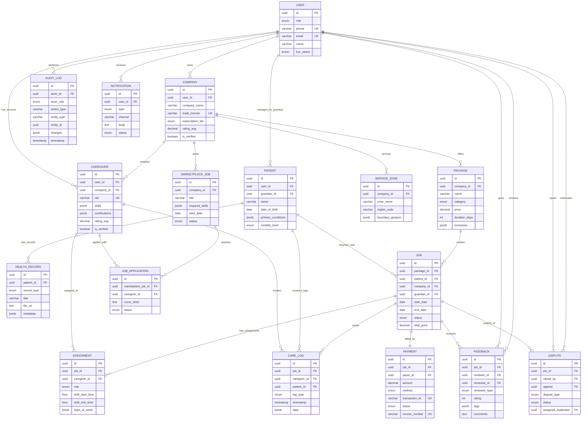

# Data Model (Key Entities)

**Version:** 1.0  
**Last Updated:** November 12, 2025  
**Database:** PostgreSQL 15+  
**ORM:** Prisma (recommended) or TypeORM

---

## Design Principles

1. **Normalization**: 3NF (Third Normal Form) to minimize redundancy
2. **Soft Deletes**: Use `deleted_at` timestamp instead of hard deletes for audit trails
3. **Timestamps**: Every table has `created_at` and `updated_at`
4. **UUIDs**: Use UUID v4 for primary keys (better for distributed systems, no sequential ID leakage)
5. **Indexes**: Add indexes on foreign keys and frequently queried columns
6. **Partitioning**: Partition large tables (logs, audit_logs) by date for performance
7. **JSON Fields**: Use JSONB for flexible metadata (search_metadata, preferences)

## Core Entities (Detailed)

### User
| Field | Type | Constraints | Description |
|-------|------|-------------|-------------|
| `id` | UUID | PRIMARY KEY | Unique identifier |
| `role` | ENUM | NOT NULL | `super_admin`, `moderator`, `company`, `caregiver`, `guardian`, `patient` |
| `phone` | VARCHAR(20) | UNIQUE, NOT NULL | Primary login identifier (BD format: +8801XXXXXXXXX) |
| `email` | VARCHAR(255) | UNIQUE, NULLABLE | Optional for elderly users |
| `password_hash` | VARCHAR(255) | NOT NULL | bcrypt hashed |
| `name` | VARCHAR(255) | NOT NULL | Full name |
| `language` | VARCHAR(5) | DEFAULT 'en' | `en` or `bn` |
| `kyc_status` | ENUM | DEFAULT 'pending' | `pending`, `verified`, `rejected` |
| `kyc_document_url` | TEXT | NULLABLE | Link to NID/passport scan |
| `mfa_enabled` | BOOLEAN | DEFAULT false | Two-factor authentication |
| `mfa_secret` | VARCHAR(255) | NULLABLE | TOTP secret |
| `last_login_at` | TIMESTAMP | NULLABLE | Track activity |
| `is_active` | BOOLEAN | DEFAULT true | Account status |
| `deleted_at` | TIMESTAMP | NULLABLE | Soft delete |
| `created_at` | TIMESTAMP | NOT NULL | Auto-generated |
| `updated_at` | TIMESTAMP | NOT NULL | Auto-updated |

**Indexes**:
```sql
CREATE INDEX idx_user_phone ON users(phone);
CREATE INDEX idx_user_email ON users(email);
CREATE INDEX idx_user_role ON users(role);
CREATE INDEX idx_user_kyc_status ON users(kyc_status);
```

---

### Company
| Field | Type | Constraints | Description |
|-------|------|-------------|-------------|
| `id` | UUID | PRIMARY KEY | Unique identifier |
| `user_id` | UUID | FOREIGN KEY → users(id) | Owner account |
| `company_name` | VARCHAR(255) | NOT NULL | Legal business name |
| `trade_license` | VARCHAR(100) | UNIQUE, NOT NULL | Government registration number |
| `trade_license_url` | TEXT | NULLABLE | Scanned document |
| `tin` | VARCHAR(50) | NULLABLE | Tax identification number |
| `contact_person` | VARCHAR(255) | NOT NULL | Primary contact name |
| `contact_phone` | VARCHAR(20) | NOT NULL | Support number |
| `contact_email` | VARCHAR(255) | NULLABLE | Support email |
| `address` | TEXT | NOT NULL | Physical office address |
| `logo_url` | TEXT | NULLABLE | Company logo (S3 link) |
| `description` | TEXT | NULLABLE | About the company |
| `specializations` | JSONB | NULLABLE | `["elderly_care", "post_surgery", "dementia"]` |
| `payout_method` | ENUM | NOT NULL | `bank_transfer`, `bkash`, `nagad` |
| `payout_account` | VARCHAR(255) | NOT NULL | Account number/mobile wallet |
| `commission_rate` | DECIMAL(5,2) | DEFAULT 12.00 | Platform commission % |
| `subscription_tier` | ENUM | DEFAULT 'starter' | `starter`, `growth`, `enterprise` |
| `subscription_expires_at` | TIMESTAMP | NULLABLE | Subscription end date |
| `rating_avg` | DECIMAL(3,2) | DEFAULT 0.00 | Aggregate rating (0-5) |
| `rating_count` | INTEGER | DEFAULT 0 | Total reviews |
| `is_verified` | BOOLEAN | DEFAULT false | Moderator approval |
| `verification_notes` | TEXT | NULLABLE | Moderator comments |
| `deleted_at` | TIMESTAMP | NULLABLE | Soft delete |
| `created_at` | TIMESTAMP | NOT NULL | |
| `updated_at` | TIMESTAMP | NOT NULL | |

**Indexes**:
```sql
CREATE INDEX idx_company_user_id ON companies(user_id);
CREATE INDEX idx_company_verified ON companies(is_verified);
CREATE INDEX idx_company_rating ON companies(rating_avg DESC);
```

---

### Caregiver
| Field | Type | Constraints | Description |
|-------|------|-------------|-------------|
| `id` | UUID | PRIMARY KEY | |
| `user_id` | UUID | FOREIGN KEY → users(id) | Login account |
| `company_id` | UUID | FOREIGN KEY → companies(id), NULLABLE | Employed by (null if freelance) |
| `nid` | VARCHAR(20) | UNIQUE, NOT NULL | National ID |
| `nid_url` | TEXT | NOT NULL | Scanned NID front/back |
| `photo_url` | TEXT | NOT NULL | Profile photo |
| `date_of_birth` | DATE | NOT NULL | Age verification |
| `gender` | ENUM | NOT NULL | `male`, `female`, `other` |
| `address` | TEXT | NOT NULL | Current residence |
| `location_lat` | DECIMAL(10,8) | NULLABLE | GPS for proximity matching |
| `location_lng` | DECIMAL(11,8) | NULLABLE | |
| `skills` | JSONB | NOT NULL | `["medication_mgmt", "mobility_assist", "dementia_care"]` |
| `certifications` | JSONB | NULLABLE | `[{"name": "BNC", "expiry": "2025-12-31", "url": "..."}]` |
| `experience_years` | INTEGER | DEFAULT 0 | Total years |
| `languages` | JSONB | DEFAULT '["bn"]' | `["bn", "en"]` |
| `availability_calendar` | JSONB | NULLABLE | Weekly schedule (see schema below) |
| `hourly_rate` | DECIMAL(8,2) | NULLABLE | Expected pay (BDT) |
| `background_check_status` | ENUM | DEFAULT 'pending' | `pending`, `cleared`, `flagged` |
| `background_check_date` | DATE | NULLABLE | Last verification |
| `rating_avg` | DECIMAL(3,2) | DEFAULT 0.00 | |
| `rating_count` | INTEGER | DEFAULT 0 | |
| `total_jobs_completed` | INTEGER | DEFAULT 0 | Career stats |
| `is_available` | BOOLEAN | DEFAULT true | Currently accepting jobs |
| `is_verified` | BOOLEAN | DEFAULT false | |
| `deleted_at` | TIMESTAMP | NULLABLE | |
| `created_at` | TIMESTAMP | NOT NULL | |
| `updated_at` | TIMESTAMP | NOT NULL | |

**Availability Calendar Schema** (JSONB):
```json
{
  "monday": [{"start": "08:00", "end": "16:00"}],
  "tuesday": [{"start": "08:00", "end": "16:00"}],
  "wednesday": [],
  "thursday": [{"start": "08:00", "end": "12:00"}, {"start": "14:00", "end": "18:00"}],
  "friday": [{"start": "08:00", "end": "16:00"}],
  "saturday": [{"start": "09:00", "end": "13:00"}],
  "sunday": []
}
```

**Indexes**:
```sql
CREATE INDEX idx_caregiver_company_id ON caregivers(company_id);
CREATE INDEX idx_caregiver_location ON caregivers USING GIST(ll_to_earth(location_lat, location_lng));
CREATE INDEX idx_caregiver_skills ON caregivers USING GIN(skills);
CREATE INDEX idx_caregiver_verified ON caregivers(is_verified, is_available);
CREATE INDEX idx_caregiver_rating ON caregivers(rating_avg DESC);
```

---

### Patient
| Field | Type | Constraints | Description |
|-------|------|-------------|-------------|
| `id` | UUID | PRIMARY KEY | |
| `user_id` | UUID | FOREIGN KEY → users(id), NULLABLE | Optional self-managed account |
| `guardian_id` | UUID | FOREIGN KEY → users(id), NOT NULL | Primary guardian |
| `name` | VARCHAR(255) | NOT NULL | |
| `date_of_birth` | DATE | NOT NULL | Age calculation |
| `gender` | ENUM | NOT NULL | `male`, `female`, `other` |
| `blood_group` | VARCHAR(5) | NULLABLE | `A+`, `O-`, etc. |
| `address` | TEXT | NOT NULL | Care location |
| `emergency_contact_name` | VARCHAR(255) | NOT NULL | |
| `emergency_contact_phone` | VARCHAR(20) | NOT NULL | |
| `primary_conditions` | JSONB | NULLABLE | `["diabetes", "hypertension", "alzheimers"]` |
| `allergies` | TEXT | NULLABLE | Drug/food allergies |
| `mobility_level` | ENUM | DEFAULT 'independent' | `independent`, `assisted`, `wheelchair`, `bedridden` |
| `cognitive_status` | ENUM | DEFAULT 'normal' | `normal`, `mild_impairment`, `moderate`, `severe` |
| `photo_url` | TEXT | NULLABLE | |
| `consent_data_sharing` | BOOLEAN | DEFAULT false | Share with labs/partners |
| `consent_marketing` | BOOLEAN | DEFAULT false | Promotional emails |
| `deleted_at` | TIMESTAMP | NULLABLE | |
| `created_at` | TIMESTAMP | NOT NULL | |
| `updated_at` | TIMESTAMP | NOT NULL | |

**Indexes**:
```sql
CREATE INDEX idx_patient_guardian_id ON patients(guardian_id);
CREATE INDEX idx_patient_conditions ON patients USING GIN(primary_conditions);
```

---

### HealthRecord
| Field | Type | Constraints | Description |
|-------|------|-------------|-------------|
| `id` | UUID | PRIMARY KEY | |
| `patient_id` | UUID | FOREIGN KEY → patients(id), NOT NULL | |
| `record_type` | ENUM | NOT NULL | `prescription`, `lab_report`, `diagnosis`, `medication_schedule`, `note` |
| `title` | VARCHAR(255) | NOT NULL | "Dr. Khan's Prescription" |
| `description` | TEXT | NULLABLE | Additional context |
| `file_url` | TEXT | NULLABLE | PDF/image link |
| `metadata` | JSONB | NULLABLE | Parsed data (drugs, dosages, schedules) |
| `uploaded_by` | UUID | FOREIGN KEY → users(id) | Guardian or caregiver |
| `valid_from` | DATE | NULLABLE | Prescription start date |
| `valid_until` | DATE | NULLABLE | Prescription end date |
| `is_archived` | BOOLEAN | DEFAULT false | Hide from active view |
| `created_at` | TIMESTAMP | NOT NULL | |
| `updated_at` | TIMESTAMP | NOT NULL | |

**Metadata Schema Example** (for `medication_schedule`):
```json
{
  "medications": [
    {
      "name": "Metformin 500mg",
      "dosage": "1 tablet",
      "frequency": "twice_daily",
      "times": ["08:00", "20:00"],
      "with_food": true,
      "notes": "Take after meals"
    }
  ]
}
```

**Indexes**:
```sql
CREATE INDEX idx_health_record_patient_id ON health_records(patient_id);
CREATE INDEX idx_health_record_type ON health_records(record_type);
```

---

### Package
| Field | Type | Constraints | Description |
|-------|------|-------------|-------------|
| `id` | UUID | PRIMARY KEY | |
| `company_id` | UUID | FOREIGN KEY → companies(id), NOT NULL | |
| `name` | VARCHAR(255) | NOT NULL | "Elder Care - Daily" |
| `description` | TEXT | NOT NULL | What's included |
| `category` | ENUM | NOT NULL | `elderly_care`, `post_surgery`, `chronic_illness`, `companion`, `nursing` |
| `price` | DECIMAL(10,2) | NOT NULL | Total cost (BDT) |
| `duration_days` | INTEGER | NOT NULL | Package length |
| `hours_per_day` | INTEGER | NOT NULL | Daily care hours |
| `inclusions` | JSONB | NOT NULL | `["medication_mgmt", "vitals_monitoring", "mobility_assist"]` |
| `exclusions` | JSONB | NULLABLE | `["medical_procedures", "overnight_stay"]` |
| `caregiver_count` | INTEGER | DEFAULT 1 | Primary + backups |
| `is_active` | BOOLEAN | DEFAULT true | Available for purchase |
| `min_advance_days` | INTEGER | DEFAULT 2 | Booking notice period |
| `created_at` | TIMESTAMP | NOT NULL | |
| `updated_at` | TIMESTAMP | NOT NULL | |

**Indexes**:
```sql
CREATE INDEX idx_package_company_id ON packages(company_id);
CREATE INDEX idx_package_category ON packages(category);
CREATE INDEX idx_package_active ON packages(is_active);
```

---

### Job
| Field | Type | Constraints | Description |
|-------|------|-------------|-------------|
| `id` | UUID | PRIMARY KEY | |
| `package_id` | UUID | FOREIGN KEY → packages(id), NOT NULL | |
| `patient_id` | UUID | FOREIGN KEY → patients(id), NOT NULL | |
| `company_id` | UUID | FOREIGN KEY → companies(id), NOT NULL | |
| `guardian_id` | UUID | FOREIGN KEY → users(id), NOT NULL | Purchaser |
| `start_date` | DATE | NOT NULL | |
| `end_date` | DATE | NOT NULL | Calculated from duration |
| `status` | ENUM | DEFAULT 'pending_assignment' | `pending_assignment`, `active`, `completed`, `cancelled`, `disputed` |
| `total_price` | DECIMAL(10,2) | NOT NULL | Locked at purchase |
| `commission_amount` | DECIMAL(10,2) | NOT NULL | Platform fee |
| `payout_amount` | DECIMAL(10,2) | NOT NULL | Company receives |
| `special_instructions` | TEXT | NULLABLE | Guardian notes |
| `completion_notes` | TEXT | NULLABLE | Final summary |
| `cancelled_reason` | TEXT | NULLABLE | |
| `cancelled_at` | TIMESTAMP | NULLABLE | |
| `cancelled_by` | UUID | FOREIGN KEY → users(id), NULLABLE | |
| `created_at` | TIMESTAMP | NOT NULL | |
| `updated_at` | TIMESTAMP | NOT NULL | |

**Indexes**:
```sql
CREATE INDEX idx_job_patient_id ON jobs(patient_id);
CREATE INDEX idx_job_company_id ON jobs(company_id);
CREATE INDEX idx_job_status ON jobs(status);
CREATE INDEX idx_job_dates ON jobs(start_date, end_date);
```

---

### Assignment
| Field | Type | Constraints | Description |
|-------|------|-------------|-------------|
| `id` | UUID | PRIMARY KEY | |
| `job_id` | UUID | FOREIGN KEY → jobs(id), NOT NULL | |
| `caregiver_id` | UUID | FOREIGN KEY → caregivers(id), NOT NULL | |
| `role` | ENUM | DEFAULT 'primary' | `primary`, `backup` |
| `shift_start_time` | TIME | NOT NULL | e.g., "08:00" |
| `shift_end_time` | TIME | NOT NULL | e.g., "16:00" |
| `days_of_week` | JSONB | NOT NULL | `["monday", "tuesday", "wednesday"]` |
| `status` | ENUM | DEFAULT 'assigned' | `assigned`, `active`, `completed`, `replaced` |
| `replaced_by` | UUID | FOREIGN KEY → caregivers(id), NULLABLE | If reassigned |
| `replacement_reason` | TEXT | NULLABLE | |
| `created_at` | TIMESTAMP | NOT NULL | |
| `updated_at` | TIMESTAMP | NOT NULL | |

**Constraint**: `UNIQUE(job_id, caregiver_id, role)` to prevent duplicate assignments

**Indexes**:
```sql
CREATE INDEX idx_assignment_job_id ON assignments(job_id);
CREATE INDEX idx_assignment_caregiver_id ON assignments(caregiver_id);
```

---

### Payment
| Field | Type | Constraints | Description |
|-------|------|-------------|-------------|
| `id` | UUID | PRIMARY KEY | |
| `job_id` | UUID | FOREIGN KEY → jobs(id), NOT NULL | |
| `payer_id` | UUID | FOREIGN KEY → users(id), NOT NULL | Guardian |
| `amount` | DECIMAL(10,2) | NOT NULL | Total paid |
| `method` | ENUM | NOT NULL | `bkash`, `nagad`, `card`, `bank_transfer` |
| `transaction_id` | VARCHAR(255) | UNIQUE, NOT NULL | Gateway reference |
| `status` | ENUM | DEFAULT 'pending' | `pending`, `completed`, `failed`, `refunded` |
| `invoice_number` | VARCHAR(50) | UNIQUE, NOT NULL | Auto-generated |
| `invoice_url` | TEXT | NULLABLE | PDF link |
| `receipt_url` | TEXT | NULLABLE | PDF link |
| `paid_at` | TIMESTAMP | NULLABLE | Completion timestamp |
| `refund_amount` | DECIMAL(10,2) | DEFAULT 0.00 | Partial/full refunds |
| `refund_reason` | TEXT | NULLABLE | |
| `gateway_response` | JSONB | NULLABLE | Raw API response for debugging |
| `created_at` | TIMESTAMP | NOT NULL | |
| `updated_at` | TIMESTAMP | NOT NULL | |

**Indexes**:
```sql
CREATE INDEX idx_payment_job_id ON payments(job_id);
CREATE INDEX idx_payment_transaction_id ON payments(transaction_id);
CREATE INDEX idx_payment_status ON payments(status);
```

---

### CareLog (Visit Logs)
| Field | Type | Constraints | Description |
|-------|------|-------------|-------------|
| `id` | UUID | PRIMARY KEY | |
| `job_id` | UUID | FOREIGN KEY → jobs(id), NOT NULL | |
| `assignment_id` | UUID | FOREIGN KEY → assignments(id), NOT NULL | |
| `caregiver_id` | UUID | FOREIGN KEY → caregivers(id), NOT NULL | |
| `patient_id` | UUID | FOREIGN KEY → patients(id), NOT NULL | |
| `log_type` | ENUM | NOT NULL | `check_in`, `vitals`, `medication`, `meal`, `activity`, `incident`, `check_out` |
| `timestamp` | TIMESTAMP | NOT NULL | Action time |
| `location_lat` | DECIMAL(10,8) | NULLABLE | GPS verification |
| `location_lng` | DECIMAL(11,8) | NULLABLE | |
| `data` | JSONB | NOT NULL | Log-specific data (see schemas below) |
| `notes` | TEXT | NULLABLE | Freeform notes |
| `photo_urls` | JSONB | NULLABLE | `["url1", "url2"]` |
| `guardian_notified` | BOOLEAN | DEFAULT false | Alert sent |
| `created_at` | TIMESTAMP | NOT NULL | |

**Data Schemas by Log Type**:

**Vitals**:
```json
{
  "blood_pressure": {"systolic": 120, "diastolic": 80},
  "heart_rate": 72,
  "temperature": 98.6,
  "blood_glucose": 110,
  "oxygen_saturation": 98
}
```

**Medication**:
```json
{
  "medication_name": "Metformin 500mg",
  "dosage": "1 tablet",
  "administered_at": "2025-01-15T08:30:00Z",
  "skipped": false,
  "skip_reason": null
}
```

**Incident**:
```json
{
  "incident_type": "fall",
  "severity": "minor",
  "action_taken": "Helped patient to bed, no injury observed",
  "medical_attention_required": false
}
```

**Indexes**:
```sql
CREATE INDEX idx_care_log_job_id ON care_logs(job_id);
CREATE INDEX idx_care_log_caregiver_id ON care_logs(caregiver_id);
CREATE INDEX idx_care_log_patient_id ON care_logs(patient_id);
CREATE INDEX idx_care_log_timestamp ON care_logs(timestamp DESC);
CREATE INDEX idx_care_log_type ON care_logs(log_type);
```

**Partitioning** (for scalability):
```sql
-- Partition by month
CREATE TABLE care_logs_2025_01 PARTITION OF care_logs
    FOR VALUES FROM ('2025-01-01') TO ('2025-02-01');
```

---

### Feedback
| Field | Type | Constraints | Description |
|-------|------|-------------|-------------|
| `id` | UUID | PRIMARY KEY | |
| `job_id` | UUID | FOREIGN KEY → jobs(id), NOT NULL | Context |
| `reviewer_id` | UUID | FOREIGN KEY → users(id), NOT NULL | Who's rating |
| `reviewee_id` | UUID | FOREIGN KEY → users(id), NOT NULL | Who's being rated |
| `reviewee_type` | ENUM | NOT NULL | `caregiver`, `company`, `guardian` |
| `rating` | INTEGER | CHECK (1-5), NOT NULL | Star rating |
| `tags` | JSONB | NULLABLE | `["punctual", "caring", "professional"]` |
| `comments` | TEXT | NULLABLE | Freeform feedback |
| `is_public` | BOOLEAN | DEFAULT true | Show on profile |
| `company_response` | TEXT | NULLABLE | Company can reply |
| `responded_at` | TIMESTAMP | NULLABLE | |
| `flagged_inappropriate` | BOOLEAN | DEFAULT false | Moderator review |
| `created_at` | TIMESTAMP | NOT NULL | |
| `updated_at` | TIMESTAMP | NOT NULL | |

**Constraint**: `UNIQUE(job_id, reviewer_id, reviewee_id)` to prevent duplicate ratings

**Indexes**:
```sql
CREATE INDEX idx_feedback_reviewee ON feedback(reviewee_id, reviewee_type);
CREATE INDEX idx_feedback_job_id ON feedback(job_id);
CREATE INDEX idx_feedback_public ON feedback(is_public, rating DESC);
```

---

### AuditLog
| Field | Type | Constraints | Description |
|-------|------|-------------|-------------|
| `id` | UUID | PRIMARY KEY | |
| `actor_id` | UUID | FOREIGN KEY → users(id), NOT NULL | Who performed action |
| `actor_role` | ENUM | NOT NULL | Role at time of action |
| `action_type` | VARCHAR(100) | NOT NULL | `user.created`, `payment.completed`, `job.cancelled` |
| `entity_type` | VARCHAR(50) | NOT NULL | `user`, `job`, `payment`, etc. |
| `entity_id` | UUID | NOT NULL | Target record |
| `changes` | JSONB | NULLABLE | Before/after snapshot |
| `ip_address` | INET | NULLABLE | Request origin |
| `user_agent` | TEXT | NULLABLE | Browser/device info |
| `timestamp` | TIMESTAMP | NOT NULL | |

**Changes Schema Example**:
```json
{
  "before": {"status": "pending"},
  "after": {"status": "active"},
  "fields_changed": ["status"]
}
```

**Indexes**:
```sql
CREATE INDEX idx_audit_actor_id ON audit_logs(actor_id);
CREATE INDEX idx_audit_entity ON audit_logs(entity_type, entity_id);
CREATE INDEX idx_audit_timestamp ON audit_logs(timestamp DESC);
CREATE INDEX idx_audit_action ON audit_logs(action_type);
```

**Partitioning**:
```sql
-- Partition by quarter
CREATE TABLE audit_logs_2025_q1 PARTITION OF audit_logs
    FOR VALUES FROM ('2025-01-01') TO ('2025-04-01');
```

---

### ServiceZone
| Field | Type | Constraints | Description |
|-------|------|-------------|-------------|
| `id` | UUID | PRIMARY KEY | |
| `company_id` | UUID | FOREIGN KEY → companies(id), NOT NULL | |
| `zone_name` | VARCHAR(255) | NOT NULL | "Gulshan", "Dhanmondi" |
| `region_code` | VARCHAR(20) | NOT NULL | Postal code or area code |
| `boundary_geojson` | JSONB | NULLABLE | Polygon coordinates (future) |
| `is_active` | BOOLEAN | DEFAULT true | Currently servicing |
| `created_at` | TIMESTAMP | NOT NULL | |
| `updated_at` | TIMESTAMP | NOT NULL | |

**Indexes**:
```sql
CREATE INDEX idx_service_zone_company_id ON service_zones(company_id);
CREATE INDEX idx_service_zone_region ON service_zones(region_code);
```

---

### Dispute
| Field | Type | Constraints | Description |
|-------|------|-------------|-------------|
| `id` | UUID | PRIMARY KEY | |
| `job_id` | UUID | FOREIGN KEY → jobs(id), NOT NULL | |
| `raised_by` | UUID | FOREIGN KEY → users(id), NOT NULL | |
| `against` | UUID | FOREIGN KEY → users(id), NOT NULL | |
| `dispute_type` | ENUM | NOT NULL | `payment`, `quality`, `safety`, `no_show`, `other` |
| `description` | TEXT | NOT NULL | Details |
| `evidence_urls` | JSONB | NULLABLE | `["screenshot1.png", "photo2.jpg"]` |
| `status` | ENUM | DEFAULT 'open' | `open`, `under_review`, `resolved`, `closed` |
| `assigned_moderator` | UUID | FOREIGN KEY → users(id), NULLABLE | |
| `resolution` | TEXT | NULLABLE | Moderator decision |
| `resolution_action` | ENUM | NULLABLE | `refund_full`, `refund_partial`, `warning`, `suspend_caregiver`, `no_action` |
| `resolved_at` | TIMESTAMP | NULLABLE | |
| `created_at` | TIMESTAMP | NOT NULL | |
| `updated_at` | TIMESTAMP | NOT NULL | |

**Indexes**:
```sql
CREATE INDEX idx_dispute_job_id ON disputes(job_id);
CREATE INDEX idx_dispute_status ON disputes(status);
CREATE INDEX idx_dispute_moderator ON disputes(assigned_moderator);
```

---

### Notification
| Field | Type | Constraints | Description |
|-------|------|-------------|-------------|
| `id` | UUID | PRIMARY KEY | |
| `user_id` | UUID | FOREIGN KEY → users(id), NOT NULL | Recipient |
| `type` | ENUM | NOT NULL | `sms`, `email`, `push`, `in_app` |
| `channel` | VARCHAR(50) | NOT NULL | `twilio`, `sendgrid`, `fcm` |
| `title` | VARCHAR(255) | NULLABLE | Push/in-app title |
| `body` | TEXT | NOT NULL | Message content |
| `data` | JSONB | NULLABLE | Additional payload |
| `status` | ENUM | DEFAULT 'pending' | `pending`, `sent`, `delivered`, `failed`, `read` |
| `sent_at` | TIMESTAMP | NULLABLE | |
| `delivered_at` | TIMESTAMP | NULLABLE | |
| `read_at` | TIMESTAMP | NULLABLE | For in-app |
| `error_message` | TEXT | NULLABLE | Failure reason |
| `created_at` | TIMESTAMP | NOT NULL | |

**Indexes**:
```sql
CREATE INDEX idx_notification_user_id ON notifications(user_id);
CREATE INDEX idx_notification_status ON notifications(status);
CREATE INDEX idx_notification_sent_at ON notifications(sent_at DESC);
```

---

### MarketplaceJob (Phase 2)
| Field | Type | Constraints | Description |
|-------|------|-------------|-------------|
| `id` | UUID | PRIMARY KEY | |
| `company_id` | UUID | FOREIGN KEY → companies(id), NOT NULL | Posted by |
| `title` | VARCHAR(255) | NOT NULL | "Need Elder Care Nurse - Gulshan" |
| `description` | TEXT | NOT NULL | |
| `location` | VARCHAR(255) | NOT NULL | |
| `required_skills` | JSONB | NOT NULL | `["medication_mgmt", "mobility_assist"]` |
| `start_date` | DATE | NOT NULL | |
| `duration_days` | INTEGER | NOT NULL | |
| `hours_per_day` | INTEGER | NOT NULL | |
| `offered_rate` | DECIMAL(8,2) | NOT NULL | Per hour/day |
| `status` | ENUM | DEFAULT 'open' | `open`, `closed`, `filled` |
| `created_at` | TIMESTAMP | NOT NULL | |
| `updated_at` | TIMESTAMP | NOT NULL | |

**Indexes**:
```sql
CREATE INDEX idx_marketplace_job_company_id ON marketplace_jobs(company_id);
CREATE INDEX idx_marketplace_job_status ON marketplace_jobs(status);
```

---

## ER Diagram (Mermaid)


---

## ASCII Diagram (Comprehensive View)
```
                                    ┌──────────┐
                                    │   USER   │
                                    └─────┬────┘
                                          │
                    ┌─────────────────────┼─────────────────────┐
                    │                     │                     │
                    ▼                     ▼                     ▼
              ┌──────────┐          ┌──────────┐         ┌──────────┐
              │ COMPANY  │          │ PATIENT  │         │CAREGIVER │
              └────┬─────┘          └────┬─────┘         └────┬─────┘
                   │                     │                     │
         ┌─────────┼──────────┐          │                     │
         │         │          │          │                     │
         ▼         ▼          ▼          │                     │
    ┌────────┐┌────────┐┌────────┐      │                     │
    │PACKAGE ││SERVICE ││ MKTP   │      │                     │
    │        ││ ZONE   ││ JOB    │      │                     │
    └───┬────┘└────────┘└───┬────┘      │                     │
        │                   │           │                     │
        │                   └───────────┼─────────────────────┤
        │                               │                     │
        └───────────────┐               │                     │
                        ▼               ▼                     ▼
                    ┌────────────────────────────────────────────┐
                    │                  JOB                       │
                    └───┬─────────────────┬──────────────────┬──┘
                        │                 │                  │
            ┌───────────┼─────────────┐   │                  │
            ▼           ▼             ▼   ▼                  ▼
      ┌──────────┐┌──────────┐┌──────────┐┌──────────┐┌──────────┐
      │ASSIGNMENT││ PAYMENT  ││ CARE_LOG ││ FEEDBACK ││ DISPUTE  │
      └──────────┘└──────────┘└──────────┘└──────────┘└──────────┘
                                                             │
                                                             ▼
                                                      ┌──────────┐
                                                      │MODERATOR │
                                                      └──────────┘

Supporting Tables:
  • HEALTH_RECORD → linked to PATIENT
  • NOTIFICATION → linked to USER
  • AUDIT_LOG → tracks all entity changes
  • JOB_APPLICATION → linked to MARKETPLACE_JOB + CAREGIVER
```

---

## Database Size Estimates (Year 1)

| Table | Est. Records | Growth Rate | Storage (GB) | Notes |
|-------|--------------|-------------|--------------|-------|
| **users** | 15,000 | Medium | 0.05 | Companies, caregivers, guardians |
| **companies** | 100 | Low | 0.001 | Year 1 target |
| **caregivers** | 10,000 | High | 0.5 | Includes photos/docs |
| **patients** | 20,000 | High | 0.2 | Multiple per guardian |
| **health_records** | 50,000 | High | 2.0 | PDF/images stored in S3 |
| **packages** | 500 | Low | 0.001 | Multiple per company |
| **jobs** | 100,000 | High | 1.0 | Primary growth driver |
| **assignments** | 150,000 | High | 0.5 | Primary + backup |
| **care_logs** | 5,000,000 | Very High | 10.0 | Daily logs per job |
| **payments** | 100,000 | High | 0.5 | One per job |
| **feedback** | 80,000 | High | 0.3 | 80% jobs get rated |
| **audit_logs** | 2,000,000 | Very High | 5.0 | All actions tracked |
| **notifications** | 3,000,000 | Very High | 1.0 | Pruned after 90 days |
| **disputes** | 2,000 | Low | 0.01 | ~2% of jobs |
| **service_zones** | 500 | Low | 0.001 | Multiple per company |
| **marketplace_jobs** | 10,000 | Medium (Phase 2) | 0.1 | |
| **job_applications** | 50,000 | High (Phase 2) | 0.2 | |
| **TOTAL** | **10.9M+** | | **~21 GB** | Excluding S3 files |

**S3 Storage** (files): ~500 GB (photos, documents, PDFs)

**Scaling Considerations**:
- **care_logs** will be the largest table → **partition by month**
- **audit_logs** second largest → **partition by quarter**
- **notifications** purged after 90 days → **auto-cleanup job**
- Total database size Year 3: **~150 GB** (with partitioning & archival)

---

## Index Size Impact

**Rule of Thumb**: Indexes add **30-50%** overhead to table size

| Table | Indexes | Est. Index Size | Total (Table + Indexes) |
|-------|---------|-----------------|-------------------------|
| **care_logs** | 5 indexes | +3 GB | 13 GB |
| **audit_logs** | 4 indexes | +1.5 GB | 6.5 GB |
| **caregivers** | 6 indexes (incl. GIN, GiST) | +0.3 GB | 0.8 GB |

**Total DB Size with Indexes**: **~30 GB** (Year 1)

---

## Performance Baselines (Target)

| Operation | Target Latency | Max Acceptable | Notes |
|-----------|----------------|----------------|-------|
| **User login** | <200ms | <500ms | Includes JWT generation |
| **Caregiver search** | <300ms | <500ms | With filters + geospatial |
| **Job creation** | <500ms | <1s | Includes payment processing |
| **Care log insert** | <100ms | <200ms | High frequency operation |
| **Dashboard load** | <1s | <2s | Aggregated data + charts |
| **Payment webhook** | <200ms | <500ms | Critical for gateway timeout |
| **Report generation** | <3s | <5s | PDF generation |
| **Bulk export (1000 rows)** | <2s | <5s | CSV download |

**Load Testing Targets**:
- **Concurrent Users**: 10K (Year 1) → 50K (Year 3)
- **Requests/Second**: 1K (Year 1) → 10K (Year 3)
- **Database Connections**: 100 (pooled) → 500 (with read replicas)

---

## Disaster Recovery Matrix

| Scenario | RTO | RPO | Recovery Procedure |
|----------|-----|-----|-------------------|
| **Database Corruption** | 2 hours | 1 hour | Restore from latest backup + replay WAL |
| **Data Center Failure** | 4 hours | 15 minutes | Failover to standby replica (different AZ) |
| **Accidental DELETE** | 30 minutes | 1 hour | Point-in-time recovery (PITR) |
| **Ransomware/Malware** | 6 hours | 24 hours | Restore from immutable S3 backup |
| **Region-Wide Outage** | 8 hours | 1 hour | Cross-region replica promotion |

**Testing Schedule**:
- **Backup Restore**: Monthly
- **Failover Drill**: Quarterly
- **Full DR Simulation**: Annually

---

## Database Constraints & Business Rules

### Check Constraints
```sql
-- Ensure ratings are between 1-5
ALTER TABLE feedback ADD CONSTRAINT chk_rating_range 
  CHECK (rating >= 1 AND rating <= 5);

-- Ensure commission rate is reasonable
ALTER TABLE companies ADD CONSTRAINT chk_commission_rate 
  CHECK (commission_rate >= 0 AND commission_rate <= 30);

-- Ensure job dates are logical
ALTER TABLE jobs ADD CONSTRAINT chk_job_dates 
  CHECK (end_date >= start_date);

-- Ensure shift times are logical
ALTER TABLE assignments ADD CONSTRAINT chk_shift_times 
  CHECK (shift_end_time > shift_start_time);

-- Ensure payment amounts are positive
ALTER TABLE payments ADD CONSTRAINT chk_payment_amount 
  CHECK (amount > 0);

-- Ensure refund doesn't exceed payment
ALTER TABLE payments ADD CONSTRAINT chk_refund_amount 
  CHECK (refund_amount <= amount);
```

### Unique Constraints (Beyond Primary Keys)
```sql
-- Prevent duplicate active assignments for same caregiver at same time
CREATE UNIQUE INDEX idx_unique_active_assignment 
ON assignments(caregiver_id, job_id) 
WHERE status = 'active';

-- Prevent duplicate feedback for same job
ALTER TABLE feedback ADD CONSTRAINT uq_feedback_per_job 
  UNIQUE (job_id, reviewer_id, reviewee_id);

-- Prevent duplicate job applications
ALTER TABLE job_applications ADD CONSTRAINT uq_application_per_job 
  UNIQUE (marketplace_job_id, caregiver_id);

-- Ensure phone numbers are unique
ALTER TABLE users ADD CONSTRAINT uq_user_phone UNIQUE (phone);

-- Ensure transaction IDs are unique
ALTER TABLE payments ADD CONSTRAINT uq_transaction_id UNIQUE (transaction_id);
```

### Business Logic Triggers
```sql
-- Auto-update job status when all assignments complete
CREATE OR REPLACE FUNCTION update_job_status_on_assignment_completion()
RETURNS TRIGGER AS $$
BEGIN
  IF (SELECT COUNT(*) FROM assignments 
      WHERE job_id = NEW.job_id AND status != 'completed') = 0 
  THEN
    UPDATE jobs SET status = 'completed', updated_at = NOW() 
    WHERE id = NEW.job_id;
  END IF;
  RETURN NEW;
END;
$$ LANGUAGE plpgsql;

CREATE TRIGGER trg_assignment_completed
AFTER UPDATE OF status ON assignments
FOR EACH ROW 
WHEN (NEW.status = 'completed')
EXECUTE FUNCTION update_job_status_on_assignment_completion();

-- Auto-increment applications_count on marketplace_jobs
CREATE OR REPLACE FUNCTION increment_application_count()
RETURNS TRIGGER AS $$
BEGIN
  UPDATE marketplace_jobs 
  SET applications_count = applications_count + 1 
  WHERE id = NEW.marketplace_job_id;
  RETURN NEW;
END;
$$ LANGUAGE plpgsql;

CREATE TRIGGER trg_application_created
AFTER INSERT ON job_applications
FOR EACH ROW 
EXECUTE FUNCTION increment_application_count();

-- Log all data changes to audit_logs
CREATE OR REPLACE FUNCTION log_audit_trail()
RETURNS TRIGGER AS $$
BEGIN
  INSERT INTO audit_logs (
    actor_id, actor_role, action_type, entity_type, entity_id, 
    changes, timestamp
  ) VALUES (
    current_setting('app.current_user_id')::uuid,
    current_setting('app.current_user_role')::text,
    TG_OP || '.' || TG_TABLE_NAME,
    TG_TABLE_NAME,
    COALESCE(NEW.id, OLD.id),
    jsonb_build_object('before', to_jsonb(OLD), 'after', to_jsonb(NEW)),
    NOW()
  );
  RETURN COALESCE(NEW, OLD);
END;
$$ LANGUAGE plpgsql;

-- Apply to critical tables
CREATE TRIGGER trg_audit_jobs
AFTER INSERT OR UPDATE OR DELETE ON jobs
FOR EACH ROW EXECUTE FUNCTION log_audit_trail();

CREATE TRIGGER trg_audit_payments
AFTER INSERT OR UPDATE OR DELETE ON payments
FOR EACH ROW EXECUTE FUNCTION log_audit_trail();
```

---