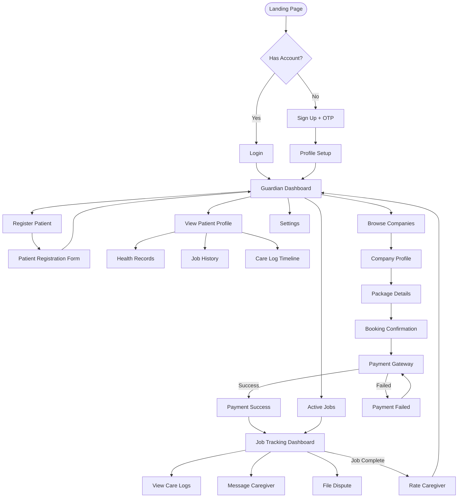
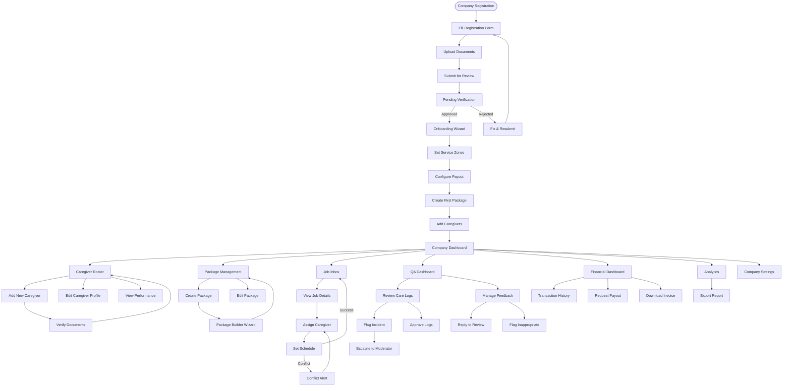
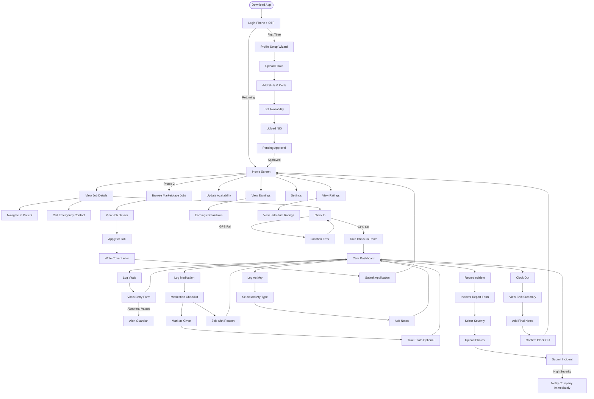

# UX Flow & Screen Transitions

**Version:** 1.0  
**Last Updated:** November 12, 2025  
**Design System:** Based on modern component libraries (shadcn/ui, Tailwind CSS)  
**Target Devices:** Desktop (1920×1080+), Tablet (768×1024), Mobile (375×667+)

---

## Design Philosophy

### Core Principles
1. **Simplicity First**: Minimize cognitive load, especially for elderly users
2. **Progressive Disclosure**: Show advanced features only when needed
3. **Contextual Help**: Inline tooltips and guidance throughout
4. **Accessibility by Default**: WCAG 2.1 AA compliance across all interfaces
5. **Responsive Design**: Mobile-first approach with desktop enhancements
6. **Bilingual Support**: Seamless switching between English and Bengali

### Visual Language
- **Typography**: 
  - Primary: Inter or Nunito Sans (high readability)
  - Minimum: 16px body text, 14px for labels
  - Headings: 24px (H1), 20px (H2), 18px (H3)
- **Spacing**: 8px grid system (8, 16, 24, 32, 48, 64px)
- **Borders**: Rounded corners (4px buttons, 8px cards, 12px modals)
- **Shadows**: Subtle elevation (0-4 levels for depth perception)

---

## Web App Workflow
1. Guardian logs in → Dashboard → Register Patient → Select Company → Purchase Package → Confirm Payment.  
2. Company Dashboard → Manage Packages → Assign Caregiver → Track Job → Generate Invoice.  
3. Moderator Panel → Verify Submissions → Approve Companies & Caregivers.  

## Mobile App (Caregiver)
1. Login → View Assigned Jobs  
2. Tap Job → View Schedule → Clock-In/Out  
3. Add Vitals → Submit Notes → Notify Guardian  
4. Receive Rating → Update Availability  

---


## Screen Transition Diagrams

### Guardian Flow (Complete)


---

### Company Flow (Complete)


### Caregiver Flow (Complete)


### Moderator Flow (Complete)

```mermaid
flowchart TB
    Start([Admin Login]) --> MFA[Enter MFA Code]
    MFA --> AdminDash[Admin Dashboard]
    
    AdminDash --> VerificationQueue[Verification Queue]
    AdminDash --> CVPool[Caregiver CV Pool]
    AdminDash --> DisputeCenter[Dispute Center]
    AdminDash --> UserMgmt[User Management]
    AdminDash --> PlatformAnalytics[Platform Analytics]
    AdminDash --> ContentMod[Content Moderation]
    AdminDash --> SystemSettings[System Settings]
    
    VerificationQueue --> CompanyVerify[Company Verification]
    VerificationQueue --> CaregiverVerify[Caregiver Verification]
    
    CompanyVerify --> ViewCompanyDocs[View Documents]
    ViewCompanyDocs --> CheckLicense[Verify Trade License]
    CheckLicense -->|Valid| ApproveCompany[Approve Company]
    CheckLicense -->|Invalid| RejectCompany[Reject with Reason]
    CheckLicense -->|Unclear| RequestMoreInfo[Request More Info]
    ApproveCompany --> SendApprovalEmail[Send Approval Email]
    RejectCompany --> SendRejectionEmail[Send Rejection Email]
    SendApprovalEmail --> VerificationQueue
    SendRejectionEmail --> VerificationQueue
    RequestMoreInfo --> VerificationQueue
    
    CaregiverVerify --> ViewCaregiverDocs[View Caregiver Docs]
    ViewCaregiverDocs --> CheckNID[Verify NID]
    ViewCaregiverDocs --> CheckCerts[Verify Certifications]
    CheckNID -->|Valid| CheckBackground[Background Check]
    CheckBackground -->|Clear| ApproveCaregiver[Approve Caregiver]
    CheckBackground -->|Flagged| RejectCaregiver[Reject/Flag]
    ApproveCaregiver --> AddToCVPool[Add to CV Pool]
    AddToCVPool --> VerificationQueue
    
    CVPool --> SearchCaregivers[Search by Skills/Location]
    SearchCaregivers --> ViewCaregiverProfile[View Profile]
    ViewCaregiverProfile --> AssignToJob[Assign to Marketplace Job]
    AssignToJob --> CVPool
    
    DisputeCenter --> ViewDisputes[View Active Disputes]
    ViewDisputes --> OpenCase[Open Dispute Case]
    OpenCase --> ReviewEvidence[Review Evidence]
    ReviewEvidence --> ViewTimeline[View Case Timeline]
    ViewTimeline --> ContactParties[Contact Involved Parties]
    ViewTimeline --> MakeDecision[Make Decision]
    
    MakeDecision --> IssueRefund[Issue Full/Partial Refund]
    MakeDecision --> WarnUser[Issue Warning]
    MakeDecision --> SuspendUser[Suspend Account]
    MakeDecision --> NoAction[Close with No Action]
    
    IssueRefund --> DocumentResolution[Document Resolution]
    WarnUser --> DocumentResolution
    SuspendUser --> DocumentResolution
    NoAction --> DocumentResolution
    DocumentResolution --> NotifyParties[Notify All Parties]
    NotifyParties --> DisputeCenter
    
    UserMgmt --> SearchUsers[Search Users]
    SearchUsers --> ViewUserDetail[View User Details]
    ViewUserDetail --> EditUser[Edit User Info]
    ViewUserDetail --> BanUser[Ban User]
    ViewUserDetail --> ViewAuditLog[View User Audit Log]
    EditUser --> UserMgmt
    BanUser --> UserMgmt
    
    PlatformAnalytics --> ViewCharts[View Charts & Metrics]
    ViewCharts --> CustomReport[Create Custom Report]
    CustomReport --> ExportData[Export PDF/CSV]
    ExportData --> PlatformAnalytics
    
    ContentMod --> ViewFlagged[View Flagged Content]
    ViewFlagged --> ReviewContent[Review Flagged Review]
    ReviewContent --> HideContent[Hide Content]
    ReviewContent --> BanPoster[Ban User]
    ReviewContent --> DismissFlag[Dismiss Flag]
    HideContent --> ContentMod
    BanPoster --> ContentMod
    DismissFlag --> ContentMod
    
    SystemSettings --> FeatureFlags[Manage Feature Flags]
    SystemSettings --> PlatformConfig[Platform Configuration]
    SystemSettings --> ViewAuditLogs[View System Audit Logs]
```


---


## Accessibility (A11Y) Implementation

### WCAG 2.1 AA Compliance Checklist

#### Visual Accessibility
**Color Contrast**:

✓ Text (normal): 4.5:1 minimum contrast ratio
✓ Text (large 18pt+): 3:1 minimum contrast ratio
✓ UI Components: 3:1 minimum contrast ratio
✓ Color not sole indicator (use icons + text)

Example:
- Primary button: #00AEEF text on #FFFFFF bg = 8.2:1 ✓
- Error text: #FF4D4D on #0e0e0e bg = 11.4:1 ✓

**Typography**:

✓ Base font size: 16px (1rem)
✓ Minimum font size: 14px (labels, captions)
✓ Line height: 1.5 for body text
✓ Letter spacing: 0.02em for better readability
✓ Font family: Sans-serif (Inter, Nunito Sans) for better legibility

**Zoom Support**:

✓ Layout doesn't break at 200% zoom
✓ No horizontal scrolling at 320px viewport width
✓ Text reflows properly when zoomed

---

#### Keyboard Navigation
**Tab Order**:

✓ Logical tab sequence (top-to-bottom, left-to-right)
✓ All interactive elements keyboard-accessible
✓ Skip navigation link at page top
✓ Focus visible (2px solid outline, 4px offset)

Example CSS:
```css
*:focus-visible {
  outline: 2px solid #00AEEF;
  outline-offset: 4px;
  border-radius: 4px;
}
```

**Keyboard Shortcuts**:

Guardian Dashboard:
- Alt + N: Add new patient
- Alt + B: Book package
- Alt + S: Search companies

Company Dashboard:
- Alt + A: Assign caregiver
- Alt + C: Create package
- Alt + R: View reports

Global:
- Ctrl + K: Open search
- Esc: Close modal/drawer
- Tab: Next element
- Shift + Tab: Previous element
- Enter/Space: Activate button

---

#### Screen Reader Support

**ARIA Labels**:
```html
<!-- Navigation -->
<nav aria-label="Main navigation">
  <ul>
    <li><a href="/dashboard" aria-current="page">Dashboard</a></li>
    <li><a href="/patients">Patients</a></li>
  </ul>
</nav>

<!-- Buttons with icons only -->
<button aria-label="Add patient">
  <PlusIcon aria-hidden="true" />
</button>

<!-- Form inputs -->
<label for="patient-name">Patient Name</label>
<input 
  id="patient-name" 
  type="text" 
  aria-required="true"
  aria-describedby="name-help"
/>
<span id="name-help">Enter full name as per NID</span>

<!-- Loading states -->
<div role="status" aria-live="polite">
  <span>Loading patients...</span>
  <Spinner aria-hidden="true" />
</div>

<!-- Error messages -->
<div role="alert" aria-live="assertive">
  <p>Payment failed. Please try again.</p>
</div>

<!-- Progress indicators -->
<div role="progressbar" 
     aria-valuenow="3" 
     aria-valuemin="1" 
     aria-valuemax="5"
     aria-label="Step 3 of 5: Patient Registration">
  Step 3 of 5
</div>

Dynamic Content Announcements:

// New care log notification
<div aria-live="polite" aria-atomic="true">
  New care log from Fatima: Blood pressure recorded at 120/80
</div>

// Error announcements (high priority)
<div aria-live="assertive" role="alert">
  Error: Unable to save patient information. Please check your connection.
</div>

// Status updates (low priority)
<div aria-live="polite" aria-atomic="false">
  Caregiver is on the way. ETA: 15 minutes.
</div>
```

---

#### Mobile Accessibility

**Touch Targets**:

✓ Minimum size: 44×44px (iOS), 48×48px (Android)
✓ Spacing between targets: 8px minimum
✓ Avoid tiny icons without sufficient padding

Example:
```html
<button style="min-width: 48px; min-height: 48px; padding: 12px;">
  <Icon size={24} />
</button>
```

**Gestures**:

✓ All functionality accessible via tap (no swipe-only)
✓ Provide alternatives to complex gestures
✓ Avoid long-press as sole interaction method

Example:
- Swipe to delete → Also provide "Delete" button
- Pinch to zoom → Also provide zoom buttons

**Screen Reader Compatibility**:

✓ Test with TalkBack (Android)
✓ Test with VoiceOver (iOS)
✓ Group related content with <section> or role="group"
✓ Heading hierarchy (h1 → h2 → h3)

---

#### Forms Accessibility

**Labels & Instructions**:
```html
<!-- Always use <label> for inputs -->
<label for="email">Email Address</label>
<input 
  id="email" 
  type="email" 
  aria-required="true"
  aria-invalid="false"
  aria-describedby="email-error"
/>
<span id="email-error" role="alert" hidden>
  Please enter a valid email address
</span>

<!-- Fieldset for grouped inputs -->
<fieldset>
  <legend>Patient Gender</legend>
  <label><input type="radio" name="gender" value="male"> Male</label>
  <label><input type="radio" name="gender" value="female"> Female</label>
  <label><input type="radio" name="gender" value="other"> Other</label>
</fieldset>

<!-- Helper text -->
<label for="phone">Phone Number</label>
<input 
  id="phone" 
  type="tel"
  aria-describedby="phone-help"
/>
<span id="phone-help">Format: +8801XXXXXXXXX</span>

Error Handling:

<!-- Error summary at top of form -->
<div role="alert" aria-labelledby="error-summary-title">
  <h2 id="error-summary-title">There are 2 errors in this form</h2>
  <ul>
    <li><a href="#email">Email address is required</a></li>
    <li><a href="#password">Password must be at least 8 characters</a></li>
  </ul>
</div>

<!-- Inline error on field -->
<label for="email">Email Address</label>
<input 
  id="email" 
  type="email"
  aria-invalid="true"
  aria-describedby="email-error"
/>
<span id="email-error" role="alert" class="error">
  Email address is required
</span>
```

---

#### Media Accessibility

**Images**:
```html
<!-- Decorative images -->


<!-- Informative images -->


<!-- Complex images (charts) -->

<div id="chart-details" hidden>
  Detailed description: Revenue started at BDT 1M in January...
</div>

Videos (Future Phase):

<video controls>
  <source src="tutorial.mp4" type="video/mp4" />
  <track kind="captions" src="captions-en.vtt" srclang="en" label="English" />
  <track kind="captions" src="captions-bn.vtt" srclang="bn" label="Bengali" />
  <track kind="descriptions" src="descriptions.vtt" />
</video>
```

---

#### Notification Accessibility

**In-App Notifications**:
```html
<!-- Success notification -->
<div 
  role="status" 
  aria-live="polite" 
  class="notification success"
  aria-label="Success notification"
>
  <Icon aria-hidden="true" />
  <span>Patient successfully registered</span>
  <button aria-label="Dismiss notification">×</button>
</div>

<!-- Error notification -->
<div 
  role="alert" 
  aria-live="assertive" 
  class="notification error"
  aria-label="Error notification"
>
  <Icon aria-hidden="true" />
  <span>Payment failed. Please try again.</span>
  <button aria-label="Dismiss notification">×</button>
</div>

<!-- Info notification (auto-dismiss) -->
<div 
  role="status" 
  aria-live="polite" 
  aria-atomic="true"
  class="notification info"
>
  <span>Caregiver will arrive in 15 minutes</span>
</div>
```

Testing Checklist
Automated Testing:

# Run accessibility audits
npm run test:a11y

# Tools to use:
- axe-core (Jest integration)
- Lighthouse CI
- WAVE browser extension
- Pa11y

**Manual Testing**:

✓ Tab through entire page (no keyboard traps)
✓ Use screen reader (NVDA, JAWS, VoiceOver)
✓ Test with 200% zoom
✓ Test with Windows High Contrast mode
✓ Test with inverted colors
✓ Disable CSS (content still makes sense)
✓ Test forms with errors
✓ Test modal/drawer behavior (focus management)

**User Testing**:

✓ Test with elderly users (primary audience)
✓ Test with users with visual impairments
✓ Test with users with motor impairments
✓ Test with users using assistive technology

---

### Localization Considerations

**Bengali Language Support**:

✓ Bengali numerals option (০১২৩৪৫৬৭৮৯)
✓ Date format: DD/MM/YYYY (local preference)
✓ Currency: ৳ (Bengali Taka symbol)
✓ Right-to-left text alignment (if needed for Urdu expansion)
✓ Font support: Kalpurush, SolaimanLipi (Bengali web fonts)

**Translation Keys**:
```json
{
  "en": {
    "dashboard.welcome": "Welcome back, {{name}}",
    "patient.add": "Add Patient",
    "error.network": "No internet connection"
  },
  "bn": {
    "dashboard.welcome": "স্বাগতম, {{name}}",
    "patient.add": "রোগী যোগ করুন",
    "error.network": "ইন্টারনেট সংযোগ নেই"
  }
}
```

---

## Design System

### Color Palette

#### Primary Colors
```css
/* Primary Blue - Interactive elements, CTAs */
--color-primary-50: #E6F7FF;
--color-primary-100: #BAE7FF;
--color-primary-200: #91D5FF;
--color-primary-300: #69C0FF;
--color-primary-400: #40A9FF;
--color-primary-500: #00AEEF;  /* Main */
--color-primary-600: #008FCC;
--color-primary-700: #0070A0;
--color-primary-800: #005073;
--color-primary-900: #003147;
```

#### Semantic Colors
```css
/* Success - Confirmations, completed states */
--color-success-light: #D1F4DD;
--color-success-main: #3CCF4E;
--color-success-dark: #2BA03A;

/* Error - Errors, alerts, destructive actions */
--color-error-light: #FFE5E5;
--color-error-main: #FF4D4D;
--color-error-dark: #CC0000;

/* Warning - Cautions, pending states */
--color-warning-light: #FFF4E5;
--color-warning-main: #FFA500;
--color-warning-dark: #CC8400;

/* Info - Informational messages */
--color-info-light: #E6F7FF;
--color-info-main: #1890FF;
--color-info-dark: #096DD9;
```

#### Neutral Colors (Dark Theme)
```css
--color-bg-primary: #0e0e0e;      /* Main background */
--color-bg-secondary: #1a1a1a;    /* Cards, panels */
--color-bg-tertiary: #262626;     /* Hover states */
--color-bg-elevated: #333333;     /* Modals, dropdowns */

--color-text-primary: #FFFFFF;    /* Primary text */
--color-text-secondary: #B3B3B3;  /* Secondary text */
--color-text-tertiary: #808080;   /* Disabled, placeholders */

--color-border-default: #333333;  /* Default borders */
--color-border-hover: #4D4D4D;    /* Hover borders */
--color-border-focus: #00AEEF;    /* Focus borders */
```

#### Light Theme (Optional)
```css
--color-bg-primary-light: #FFFFFF;
--color-bg-secondary-light: #F5F5F5;
--color-bg-tertiary-light: #E8E8E8;

--color-text-primary-light: #000000;
--color-text-secondary-light: #666666;
--color-text-tertiary-light: #999999;
```

---

### Typography

#### Font Families
```css
--font-primary: 'Inter', 'Nunito Sans', -apple-system, system-ui, sans-serif;
--font-bengali: 'Kalpurush', 'SolaimanLipi', sans-serif;
--font-mono: 'Fira Code', 'Consolas', monospace;  /* For codes, IDs */
```

#### Font Sizes
```css
--font-size-xs: 12px;   /* Small labels, captions */
--font-size-sm: 14px;   /* Secondary text */
--font-size-base: 16px; /* Body text */
--font-size-lg: 18px;   /* Large body text */
--font-size-xl: 20px;   /* H3 */
--font-size-2xl: 24px;  /* H2 */
--font-size-3xl: 30px;  /* H1 */
--font-size-4xl: 36px;  /* Hero headings */
```

#### Font Weights
```css
--font-weight-normal: 400;
--font-weight-medium: 500;
--font-weight-semibold: 600;
--font-weight-bold: 700;
```

#### Line Heights
```css
--line-height-tight: 1.25;   /* Headings */
--line-height-normal: 1.5;   /* Body text */
--line-height-relaxed: 1.75; /* Long-form content */
```

---

### Spacing

**8px Grid System**:
```css
--space-1: 4px;    /* 0.5 unit */
--space-2: 8px;    /* 1 unit */
--space-3: 12px;   /* 1.5 units */
--space-4: 16px;   /* 2 units */
--space-5: 20px;   /* 2.5 units */
--space-6: 24px;   /* 3 units */
--space-8: 32px;   /* 4 units */
--space-10: 40px;  /* 5 units */
--space-12: 48px;  /* 6 units */
--space-16: 64px;  /* 8 units */
--space-20: 80px;  /* 10 units */
--space-24: 96px;  /* 12 units */
```

**Usage Guidelines**:
- Card padding: `--space-6` (24px)
- Section spacing: `--space-12` (48px)
- Button padding: `--space-4 --space-6` (16px 24px)
- Input padding: `--space-3 --space-4` (12px 16px)

---

### Border Radius
```css
--radius-sm: 4px;   /* Buttons, inputs */
--radius-md: 8px;   /* Cards, panels */
--radius-lg: 12px;  /* Modals, large components */
--radius-xl: 16px;  /* Hero sections */
--radius-full: 9999px;  /* Pills, avatars */
```

---

### Shadows

**Elevation Levels**:
```css
/* Level 1: Subtle lift (cards on page) */
--shadow-sm: 0 1px 3px rgba(0, 0, 0, 0.12), 
             0 1px 2px rgba(0, 0, 0, 0.24);

/* Level 2: Moderate lift (hover states) */
--shadow-md: 0 3px 6px rgba(0, 0, 0, 0.15), 
             0 2px 4px rgba(0, 0, 0, 0.12);

/* Level 3: High lift (dropdowns, popovers) */
--shadow-lg: 0 10px 20px rgba(0, 0, 0, 0.15), 
             0 3px 6px rgba(0, 0, 0, 0.10);

/* Level 4: Maximum lift (modals) */
--shadow-xl: 0 15px 25px rgba(0, 0, 0, 0.15), 
             0 5px 10px rgba(0, 0, 0, 0.05);

/* Focus shadow */
--shadow-focus: 0 0 0 3px rgba(0, 174, 239, 0.3);
```

---

### Transitions
```css
--transition-fast: 150ms cubic-bezier(0.4, 0, 0.2, 1);
--transition-base: 250ms cubic-bezier(0.4, 0, 0.2, 1);
--transition-slow: 350ms cubic-bezier(0.4, 0, 0.2, 1);

/* Usage */
.button {
  transition: background-color var(--transition-fast),
              transform var(--transition-fast);
}
```

---

### Components

#### Buttons
```css
/* Primary Button */
.btn-primary {
  background: var(--color-primary-500);
  color: white;
  padding: var(--space-3) var(--space-6);
  border-radius: var(--radius-sm);
  font-weight: var(--font-weight-semibold);
  transition: background var(--transition-fast);
}
.btn-primary:hover {
  background: var(--color-primary-600);
}
.btn-primary:active {
  transform: scale(0.98);
}

/* Secondary Button */
.btn-secondary {
  background: transparent;
  color: var(--color-primary-500);
  border: 2px solid var(--color-primary-500);
}

/* Danger Button */
.btn-danger {
  background: var(--color-error-main);
  color: white;
}

/* Sizes */
.btn-sm { padding: var(--space-2) var(--space-4); font-size: var(--font-size-sm); }
.btn-md { padding: var(--space-3) var(--space-6); font-size: var(--font-size-base); }
.btn-lg { padding: var(--space-4) var(--space-8); font-size: var(--font-size-lg); }
```

#### Cards
```css
.card {
  background: var(--color-bg-secondary);
  border-radius: var(--radius-md);
  padding: var(--space-6);
  box-shadow: var(--shadow-sm);
  transition: box-shadow var(--transition-base);
}
.card:hover {
  box-shadow: var(--shadow-md);
}
```

#### Inputs
```css
.input {
  background: var(--color-bg-tertiary);
  border: 1px solid var(--color-border-default);
  border-radius: var(--radius-sm);
  padding: var(--space-3) var(--space-4);
  font-size: var(--font-size-base);
  color: var(--color-text-primary);
  transition: border-color var(--transition-fast);
}
.input:focus {
  outline: none;
  border-color: var(--color-border-focus);
  box-shadow: var(--shadow-focus);
}
.input::placeholder {
  color: var(--color-text-tertiary);
}
.input:disabled {
  opacity: 0.5;
  cursor: not-allowed;
}
/* Input with error */
.input-error {
  border-color: var(--color-error-main);
}
.input-error:focus {
  box-shadow: 0 0 0 3px rgba(255, 77, 77, 0.3);
}
```

#### Badges
```css
.badge {
  display: inline-flex;
  align-items: center;
  padding: var(--space-1) var(--space-3);
  border-radius: var(--radius-full);
  font-size: var(--font-size-xs);
  font-weight: var(--font-weight-semibold);
  line-height: 1;
}

.badge-success {
  background: var(--color-success-light);
  color: var(--color-success-dark);
}

.badge-warning {
  background: var(--color-warning-light);
  color: var(--color-warning-dark);
}

.badge-error {
  background: var(--color-error-light);
  color: var(--color-error-dark);
}

.badge-info {
  background: var(--color-info-light);
  color: var(--color-info-dark);
}
```

#### Modals
```css
.modal-overlay {
  position: fixed;
  inset: 0;
  background: rgba(0, 0, 0, 0.75);
  display: flex;
  align-items: center;
  justify-content: center;
  z-index: 1000;
  animation: fadeIn var(--transition-base);
}

.modal-content {
  background: var(--color-bg-elevated);
  border-radius: var(--radius-lg);
  padding: var(--space-8);
  max-width: 600px;
  width: 90%;
  max-height: 90vh;
  overflow-y: auto;
  box-shadow: var(--shadow-xl);
  animation: slideUp var(--transition-base);
}

@keyframes fadeIn {
  from { opacity: 0; }
  to { opacity: 1; }
}

@keyframes slideUp {
  from { 
    opacity: 0;
    transform: translateY(20px);
  }
  to { 
    opacity: 1;
    transform: translateY(0);
  }
}
```

#### Tooltips
```css
.tooltip {
  position: relative;
  display: inline-block;
}

.tooltip-content {
  position: absolute;
  bottom: 100%;
  left: 50%;
  transform: translateX(-50%) translateY(-8px);
  background: var(--color-bg-elevated);
  color: var(--color-text-primary);
  padding: var(--space-2) var(--space-3);
  border-radius: var(--radius-sm);
  font-size: var(--font-size-sm);
  white-space: nowrap;
  box-shadow: var(--shadow-lg);
  opacity: 0;
  pointer-events: none;
  transition: opacity var(--transition-fast);
}

.tooltip:hover .tooltip-content {
  opacity: 1;
}

/* Tooltip arrow */
.tooltip-content::after {
  content: '';
  position: absolute;
  top: 100%;
  left: 50%;
  transform: translateX(-50%);
  border: 6px solid transparent;
  border-top-color: var(--color-bg-elevated);
}
```

#### Progress Bars
```css
.progress {
  width: 100%;
  height: 8px;
  background: var(--color-bg-tertiary);
  border-radius: var(--radius-full);
  overflow: hidden;
}

.progress-bar {
  height: 100%;
  background: var(--color-primary-500);
  border-radius: var(--radius-full);
  transition: width var(--transition-base);
}

/* Animated stripes for loading */
.progress-bar-animated {
  background-image: linear-gradient(
    45deg,
    rgba(255, 255, 255, 0.15) 25%,
    transparent 25%,
    transparent 50%,
    rgba(255, 255, 255, 0.15) 50%,
    rgba(255, 255, 255, 0.15) 75%,
    transparent 75%,
    transparent
  );
  background-size: 1rem 1rem;
  animation: progress-bar-stripes 1s linear infinite;
}

@keyframes progress-bar-stripes {
  from { background-position: 1rem 0; }
  to { background-position: 0 0; }
}
```

#### Avatars
```css
.avatar {
  display: inline-block;
  width: 40px;
  height: 40px;
  border-radius: var(--radius-full);
  object-fit: cover;
  border: 2px solid var(--color-border-default);
}

.avatar-sm { width: 32px; height: 32px; }
.avatar-md { width: 40px; height: 40px; }
.avatar-lg { width: 56px; height: 56px; }
.avatar-xl { width: 80px; height: 80px; }

/* Avatar with status indicator */
.avatar-wrapper {
  position: relative;
  display: inline-block;
}

.avatar-status {
  position: absolute;
  bottom: 0;
  right: 0;
  width: 12px;
  height: 12px;
  border-radius: var(--radius-full);
  border: 2px solid var(--color-bg-secondary);
}

.avatar-status-online { background: var(--color-success-main); }
.avatar-status-offline { background: var(--color-text-tertiary); }
.avatar-status-busy { background: var(--color-error-main); }
```

---

### Iconography

**Icon Library**: Lucide React (lightweight, consistent)

**Icon Sizes**:
```css
--icon-xs: 16px;
--icon-sm: 20px;
--icon-md: 24px;
--icon-lg: 32px;
--icon-xl: 48px;
```

**Usage Guidelines**:
- Use outlined icons for better clarity at small sizes
- Maintain 1:1 aspect ratio
- Use semantic colors (success, error, warning)
- Add `aria-hidden="true"` for decorative icons
- Pair with text labels when possible

**Common Icons**:
```jsx
import { 
  User,           // User profile, patient
  Users,          // Guardian, company
  Heart,          // Health, care
  Pill,           // Medication
  Activity,       // Vitals, health metrics
  Calendar,       // Schedule, appointments
  MapPin,         // Location, service zones
  Phone,          // Contact, emergency
  MessageSquare,  // Messaging, feedback
  Bell,           // Notifications
  CheckCircle,    // Success, completed
  AlertCircle,    // Warning, info
  XCircle,        // Error, failed
  Clock,          // Time, schedule
  DollarSign,     // Payment, earnings
  Star,           // Ratings, reviews
  Search,         // Search functionality
  Filter,         // Filters
  Download,       // Download reports
  Upload,         // Upload documents
  Settings,       // Settings, configuration
  LogOut,         // Logout
  ChevronDown,    // Dropdowns
  ChevronRight,   // Navigation
  Plus,           // Add new
  Edit,           // Edit
  Trash,          // Delete
  Eye,            // View
  EyeOff          // Hide
} from 'lucide-react';
```

## Responsive Design Breakpoints

### Breakpoints
```css
/* Mobile First Approach */
--breakpoint-xs: 0;       /* 0px - 575px (Mobile portrait) */
--breakpoint-sm: 576px;   /* 576px - 767px (Mobile landscape) */
--breakpoint-md: 768px;   /* 768px - 991px (Tablet portrait) */
--breakpoint-lg: 992px;   /* 992px - 1199px (Tablet landscape) */
--breakpoint-xl: 1200px;  /* 1200px - 1399px (Desktop) */
--breakpoint-2xl: 1400px; /* 1400px+ (Large desktop) */
```

---

### Layout Patterns

#### Guardian Dashboard

**Mobile (< 768px)**:
```
┌─────────────────────┐
│      Header         │
├─────────────────────┤
│  Patient Card 1     │
├─────────────────────┤
│  Patient Card 2     │
├─────────────────────┤
│  Patient Card 3     │
├─────────────────────┤
│  Quick Actions      │
│  (Stacked)          │
└─────────────────────┘
```

**Tablet (768px - 991px)**:
```
┌─────────────────────────────────┐
│           Header                │
├────────────────┬────────────────┤
│ Patient Card 1 │ Patient Card 2 │
├────────────────┼────────────────┤
│ Patient Card 3 │ Patient Card 4 │
├────────────────┴────────────────┤
│      Quick Actions (Row)        │
└─────────────────────────────────┘
```

**Desktop (992px+)**:
```
┌─────────┬─────────────────────────────────────┐
│         │           Header                    │
│ Sidebar ├─────────────┬─────────────┬────────┤
│         │ Patient 1   │ Patient 2   │ Stats  │
│ Nav     ├─────────────┼─────────────┤        │
│ Menu    │ Patient 3   │ Patient 4   │ Widget │
│         ├─────────────┴─────────────┴────────┤
│         │     Quick Actions (Row)            │
└─────────┴─────────────────────────────────────┘
```

---

#### Company Dashboard

**Mobile**:
```
┌──────────────┐
│   Header     │
├──────────────┤
│  KPI Card 1  │
├──────────────┤
│  KPI Card 2  │
├──────────────┤
│  KPI Card 3  │
├──────────────┤
│  Job List    │
│  (Cards)     │
└──────────────┘
```

**Desktop**:
```
┌─────┬──────────────────────────────────────┐
│     │           Header                     │
│ Nav ├───────┬───────┬───────┬──────────────┤
│     │ KPI 1 │ KPI 2 │ KPI 3 │ Quick Stats  │
│     ├───────┴───────┴───────┼──────────────┤
│     │  Job Pipeline         │  Revenue     │
│     │  (Kanban)             │  Chart       │
│     │                       │              │
│     ├───────────────────────┴──────────────┤
│     │        Recent Activity                │
└─────┴──────────────────────────────────────┘
```

---

### Component Responsiveness

#### Navigation

**Mobile**: Hamburger menu (drawer)
```jsx
<nav className="mobile-nav">
  <button onClick={toggleMenu}>☰</button>
  <Drawer open={menuOpen}>
    <NavLinks />
  </Drawer>
</nav>
```

**Desktop**: Persistent sidebar or top nav
```jsx
<nav className="desktop-nav">
  <aside className="sidebar">
    <NavLinks />
  </aside>
</nav>
```

---

#### Data Tables

**Mobile**: Card view (stacked)
```jsx
{data.map(item => (
  <Card key={item.id}>
    <div><strong>Name:</strong> {item.name}</div>
    <div><strong>Status:</strong> {item.status}</div>
    <div><strong>Date:</strong> {item.date}</div>
  </Card>
))}
```

**Tablet/Desktop**: Table view
```jsx
<table>
  <thead>
    <tr>
      <th>Name</th>
      <th>Status</th>
      <th>Date</th>
      <th>Actions</th>
    </tr>
  </thead>
  <tbody>
    {data.map(item => (
      <tr key={item.id}>
        <td>{item.name}</td>
        <td>{item.status}</td>
        <td>{item.date}</td>
        <td><ActionButtons /></td>
      </tr>
    ))}
  </tbody>
</table>
```

---

#### Forms

**Mobile**: Single column, full-width inputs
```css
@media (max-width: 767px) {
  .form-group {
    width: 100%;
    margin-bottom: var(--space-4);
  }
  
  .form-row {
    flex-direction: column;
  }
}
```

**Desktop**: Multi-column, optimized spacing
```css
@media (min-width: 768px) {
  .form-row {
    display: grid;
    grid-template-columns: repeat(2, 1fr);
    gap: var(--space-6);
  }
  
  .form-row.triple {
    grid-template-columns: repeat(3, 1fr);
  }
}
```

---

### Touch vs. Mouse Interactions

**Touch Targets (Mobile)**:
```css
/* Minimum 48x48px touch targets */
.btn-mobile {
  min-height: 48px;
  min-width: 48px;
  padding: var(--space-4);
}

/* Larger spacing between interactive elements */
.action-buttons-mobile > * + * {
  margin-top: var(--space-4);
}
```

**Hover States (Desktop)**:
```css
/* Only apply hover effects on devices that support it */
@media (hover: hover) and (pointer: fine) {
  .card:hover {
    transform: translateY(-2px);
    box-shadow: var(--shadow-md);
  }
  
  .btn:hover {
    background: var(--color-primary-600);
  }
}
```

---

### Performance Optimization

**Image Responsiveness**:
```jsx

```

**Conditional Rendering**:
```jsx
import { useMediaQuery } from '@/hooks/useMediaQuery';

function Dashboard() {
  const isMobile = useMediaQuery('(max-width: 767px)');
  
  return (
    <>
      {isMobile ? (
        <MobileLayout />
      ) : (
        <DesktopLayout />
      )}
    </>
  );
}
```

## Animation Guidelines

### Principles

1. **Purpose-Driven**: Every animation should serve a purpose (feedback, guidance, delight)
2. **Subtle**: Avoid distracting users from their primary task
3. **Fast**: Keep animations snappy (150-350ms range)
4. **Consistent**: Use same easing and timing across similar interactions
5. **Accessible**: Respect `prefers-reduced-motion` preference

---

### Motion Preferences

**Respect User Settings**:
```css
/* Disable animations for users who prefer reduced motion */
@media (prefers-reduced-motion: reduce) {
  *,
  *::before,
  *::after {
    animation-duration: 0.01ms !important;
    animation-iteration-count: 1 !important;
    transition-duration: 0.01ms !important;
    scroll-behavior: auto !important;
  }
}
```

---

### Common Animations

#### 1. Button Press
```css
.btn {
  transition: transform 150ms cubic-bezier(0.4, 0, 0.2, 1);
}

.btn:active {
  transform: scale(0.98);
}
```

#### 2. Card Hover
```css
.card {
  transition: 
    transform 250ms cubic-bezier(0.4, 0, 0.2, 1),
    box-shadow 250ms cubic-bezier(0.4, 0, 0.2, 1);
}

.card:hover {
  transform: translateY(-4px);
  box-shadow: var(--shadow-lg);
}
```

#### 3. Fade In
```css
@keyframes fadeIn {
  from {
    opacity: 0;
  }
  to {
    opacity: 1;
  }
}

.fade-in {
  animation: fadeIn 250ms ease-out;
}
```

#### 4. Slide Up
```css
@keyframes slideUp {
  from {
    opacity: 0;
    transform: translateY(20px);
  }
  to {
    opacity: 1;
    transform: translateY(0);
  }
}

.slide-up {
  animation: slideUp 350ms cubic-bezier(0.4, 0, 0.2, 1);
}
```

#### 5. Slide In (Drawer/Modal)
```css
@keyframes slideInRight {
  from {
    transform: translateX(100%);
  }
  to {
    transform: translateX(0);
  }
}

.drawer-enter {
  animation: slideInRight 300ms cubic-bezier(0.4, 0, 0.2, 1);
}
```

#### 6. Pulse (Notification Badge)
```css
@keyframes pulse {
  0%, 100% {
    transform: scale(1);
    opacity: 1;
  }
  50% {
    transform: scale(1.1);
    opacity: 0.8;
  }
}

.notification-badge {
  animation: pulse 2s cubic-bezier(0.4, 0, 0.6, 1) infinite;
}
```

#### 7. Shake (Error State)
```css
@keyframes shake {
  0%, 100% { transform: translateX(0); }
  10%, 30%, 50%, 70%, 90% { transform: translateX(-4px); }
  20%, 40%, 60%, 80% { transform: translateX(4px); }
}

.input-error {
  animation: shake 400ms cubic-bezier(0.4, 0, 0.2, 1);
}
```

#### 8. Skeleton Loading
```css
@keyframes shimmer {
  0% {
    background-position: -468px 0;
  }
  100% {
    background-position: 468px 0;
  }
}

.skeleton {
  background: linear-gradient(
    90deg,
    var(--color-bg-tertiary) 0%,
    var(--color-bg-elevated) 50%,
    var(--color-bg-tertiary) 100%
  );
  background-size: 468px 100%;
  animation: shimmer 1.2s ease-in-out infinite;
}
```

#### 9. Spinner
```css
@keyframes spin {
  from {
    transform: rotate(0deg);
  }
  to {
    transform: rotate(360deg);
  }
}

.spinner {
  width: 24px;
  height: 24px;
  border: 3px solid var(--color-border-default);
  border-top-color: var(--color-primary-500);
  border-radius: 50%;
  animation: spin 600ms linear infinite;
}
```

#### 10. Success Checkmark
```css
@keyframes checkmark {
  0% {
    stroke-dashoffset: 50;
  }
  100% {
    stroke-dashoffset: 0;
  }
}

.checkmark-path {
  stroke-dasharray: 50;
  stroke-dashoffset: 50;
  animation: checkmark 500ms cubic-bezier(0.4, 0, 0.2, 1) forwards;
}
```

---

### Micro-Interactions

**Star Rating Animation**:
```css
.star {
  transition: 
    transform 150ms cubic-bezier(0.4, 0, 0.2, 1),
    color 150ms cubic-bezier(0.4, 0, 0.2, 1);
}

.star:hover {
  transform: scale(1.2);
}

.star-filled {
  animation: fillStar 200ms cubic-bezier(0.4, 0, 0.2, 1);
}

@keyframes fillStar {
  0% { transform: scale(0.8); }
  50% { transform: scale(1.2); }
  100% { transform: scale(1); }
}
```

**Toggle Switch**:
```css
.toggle-switch {
  transition: background-color 200ms ease;
}

.toggle-handle {
  transition: transform 200ms cubic-bezier(0.4, 0, 0.2, 1);
}

.toggle-switch[data-state="on"] .toggle-handle {
  transform: translateX(20px);
}
```

**Accordion Expand/Collapse**:
```css
.accordion-content {
  overflow: hidden;
  transition: 
    max-height 300ms cubic-bezier(0.4, 0, 0.2, 1),
    opacity 300ms cubic-bezier(0.4, 0, 0.2, 1);
}

.accordion-content[data-state="closed"] {
  max-height: 0;
  opacity: 0;
}

.accordion-content[data-state="open"] {
  max-height: 500px; /* Adjust based on content */
  opacity: 1;
}
```

---

### Page Transitions

**Route Changes** (Using Framer Motion):
```jsx
import { motion } from 'framer-motion';

const pageVariants = {
  initial: { opacity: 0, y: 20 },
  enter: { opacity: 1, y: 0 },
  exit: { opacity: 0, y: -20 }
};

const pageTransition = {
  type: 'tween',
  ease: 'anticipate',
  duration: 0.4
};

export default function Page() {
  return (
    <motion.div
      initial="initial"
      animate="enter"
      exit="exit"
      variants={pageVariants}
      transition={pageTransition}
    >
      {/* Page content */}
    </motion.div>
  );
}
```

---

### Loading States

**Button Loading**:
```jsx
<button disabled={isLoading}>
  {isLoading ? (
    <>
      <Spinner className="mr-2" />
      Loading...
    </>
  ) : (
    'Submit'
  )}
</button>
```

**Full Page Loading**:
```jsx
<div className="loading-overlay">
  <div className="loading-content">
    <Spinner size="large" />
    <p>Loading your dashboard...</p>
  </div>
</div>
```
```css
.loading-overlay {
  position: fixed;
  inset: 0;
  background: rgba(14, 14, 14, 0.9);
  display: flex;
  align-items: center;
  justify-content: center;
  z-index: 9999;
  animation: fadeIn 200ms ease-out;
}

.loading-content {
  text-align: center;
  animation: slideUp 300ms ease-out 100ms backwards;
}
```

---