# Technical Architecture

## Frontend
- **Web:** React / Next.js
- **Mobile:** React Native / Flutter
- **Localization:** JSON-based packs (default English, optional Bengali)
- **Admin Panel:** React-based dashboard

### Frontend Technology Choices & Rationale

**Web Application**:
- **Framework**: Next.js 14+ (App Router)
  - SSR/SSG for SEO-critical pages (company listings, public profiles)
  - API routes for BFF (Backend-for-Frontend) pattern
  - Image optimization for caregiver photos, documents
- **State Management**: Zustand or React Context (avoid Redux overhead for MVP)
- **UI Library**: Tailwind CSS + shadcn/ui components
- **Forms**: React Hook Form + Zod validation
- **Data Fetching**: TanStack Query (React Query) for caching and optimistic updates

**Mobile Application**:
- **Framework**: React Native (Expo) for MVP speed
  - Rationale: Shared codebase with web, faster iteration
  - Future: Native modules for GPS tracking, background location
- **Navigation**: React Navigation 6+
- **Offline Support**: AsyncStorage + Redux Persist for caregiver app (submit logs when back online)
- **Push Notifications**: Expo Notifications → migrate to FCM for production

**Admin Panel**:
- **Framework**: Same Next.js app with role-gated routes
- **Charts**: Recharts or Chart.js for analytics dashboards
- **Tables**: TanStack Table for sortable, filterable data grids


---


## Backend
- **Framework:** Node.js (NestJS) or Laravel
- **API Type:** REST / GraphQL with Role-Based Access Control (RBAC)
- **Database:** PostgreSQL (primary), Redis (cache), S3-compatible (files)
- **Search Engine:** Elasticsearch for caregiver matching
- **Payment:** bKash, Nagad, cards
- **Notifications:** Firebase, Twilio, SendGrid/Mailgun

### Backend Architecture Decisions

**Framework Choice**: **NestJS** (recommended over Laravel)
- **Rationale**: 
  - TypeScript end-to-end consistency with frontend
  - Built-in dependency injection for testability
  - Native support for microservices (future-ready)
  - Strong GraphQL integration if needed
  - Active ecosystem for healthcare/HIPAA compliance

**Alternative**: Laravel if team expertise is PHP-heavy
- **Tradeoffs**: Mature payment integrations (bKash SDK), but weaker for real-time features

**API Design**:
- **Primary**: REST (MVP) → GraphQL (Phase 2 for mobile optimization)
- **Versioning**: URL-based (`/api/v1/`, `/api/v2/`)
- **Rate Limiting**: 100 req/min per user, 1000 req/min per company (Redis-backed)
- **Pagination**: Cursor-based for infinite scroll (caregiver listings), offset-based for admin tables

**Authentication Flow**:
```
1. User logs in → JWT access token (15 min expiry) + refresh token (7 days)
2. Access token in Authorization header for API calls
3. Refresh token stored in httpOnly cookie
4. MFA required for: Companies, Moderators, Super Admin
5. Device fingerprinting for anomaly detection
```

**File Upload Strategy**:
- **Documents** (NID, certificates): S3-compatible (AWS S3 or DigitalOcean Spaces)
  - Pre-signed URLs for direct upload (avoid server bottleneck)
  - Virus scanning (ClamAV) before storage
  - Auto-expire after 90 days if not verified
- **Photos** (visit verification, patient reports): 
  - Compress on client (max 2MB, 1920px width)
  - S3 with CloudFront CDN for fast delivery
  - Automatic thumbnail generation (Lambda/Cloud Function)
---

## Integration Strategy

### Payment Gateway Integration

**bKash Integration**:
- **Flow**: Checkout URL API (for web) + Tokenized API (for recurring)
- **Webhook**: `/webhooks/bkash` endpoint to capture payment status
- **Security**: Verify signature using bKash app secret
- **Idempotency**: Store `trxID` to prevent duplicate processing
- **Failure Handling**: Auto-retry 3 times with exponential backoff, then manual reconciliation

**Nagad Integration**:
- **Flow**: Similar to bKash (PGW API)
- **Fallback**: If primary gateway times out, offer alternate within 5 seconds
- **Reconciliation**: Daily cron job to match platform records with gateway settlement reports

**Card Payments** (Future - Phase 2):
- **Provider**: SSLCommerz or SSLWIRELESS
- **PCI Compliance**: Use hosted payment page (no card data touches our servers)

**Escrow Mechanism**:
```
1. Guardian pays → Funds held in escrow (separate ledger table)
2. Job completed → Guardian approves (or auto-approve after 48h)
3. Funds released → Company payout account (minus commission)
4. Dispute filed → Funds frozen until moderator resolves
```

---

### SMS & Notification Integration

**SMS Provider**: **Twilio** (primary) + **Bulk SMS BD** (backup)
- **Use Cases**: 
  - OTP for login (6-digit, 10-min expiry)
  - Job assignment alerts to caregivers
  - Payment confirmations
- **Rate Limits**: Max 5 SMS/hour per user (prevent spam)
- **Templates**: Pre-approved with provider to avoid blocking
- **Cost Optimization**: Use push notifications for non-critical alerts

**Push Notifications**: **Firebase Cloud Messaging (FCM)**
- **Channels**:
  - `critical`: Missed medication, emergency SOS (sound + vibration)
  - `updates`: Job assignment, payment received (silent)
  - `marketing`: Promotional offers (opt-in only)
- **Delivery**: Queue in Redis if user offline, retry every 5 min for 24h

**Email**: **SendGrid** (transactional) + **Mailgun** (backup)
- **Templates**: 
  - Welcome email (with onboarding checklist)
  - Invoice/Receipt (PDF attachment)
  - Weekly care summary to guardian
- **Tracking**: Open rates, click rates for analytics
- **Unsubscribe**: One-click unsubscribe for marketing emails (compliance)

---

### Health Record Imports (Future - Phase 2)

**Diagnostic Lab APIs**:
- **Partners**: Popular Diagnostics, BIRDEM, IBN SINA
- **Integration**: 
  - Labs push test results via webhook (`/api/v1/lab-results`)
  - Verify signature using shared secret
  - Parse PDF reports using OCR (Tesseract or AWS Textract)
  - Store in `health_records` table with patient consent

**Prescription Uploads**:
- **OCR**: Extract drug names, dosages, schedules from doctor's handwritten notes
- **Validation**: Match against drug database (MedEx UNIIB or custom DB)
- **Reminders**: Auto-generate medication schedule from parsed data

---

### API Versioning & Deprecation Policy

**Versioning Strategy**:
- **URL-based**: `/api/v1/users`, `/api/v2/users`
- **Breaking Changes**: Introduce new version, maintain old for 6 months
- **Non-Breaking**: Add optional fields to existing endpoints

**Deprecation Timeline**:
```
Month 0: v2 released, v1 marked as deprecated (warning header)
Month 3: Email all API consumers about v1 sunset
Month 6: v1 disabled, redirect to v2 with error message
```

**Webhook Retry Policy**:
- Failure → Retry after 1min, 5min, 30min, 2hr, 24hr
- After 5 failures → Mark as failed, alert admin
- Provide UI for companies to manually re-trigger webhooks

## Architecture Pattern
- MVP: Monolith → future-ready for **microservices**
- Event-driven with **Kafka / RabbitMQ** for scalability
- **Webhooks** for external integrations

---

## Security
- JWT / OAuth authentication
- MFA for companies and moderators
- Encryption at rest (AES-256 for health records)
- **Audit logs** for all user actions

---

## DevOps & Deployment

### Environments

| Environment | Purpose | Database | URL |
|-------------|---------|----------|-----|
| **Development** | Local dev, feature branches | Local PostgreSQL | localhost:3000 |
| **Staging** | QA, UAT, demo | Staging DB (copy of prod schema) | staging.caregiver.bd |
| **Production** | Live users | Production DB (replicated) | caregiver.bd |

**Environment Parity**: Use Docker to ensure dev/staging/prod consistency

---

### CI/CD Pipeline

**Tools**: GitHub Actions (primary) or GitLab CI

**Pipeline Stages**:
```yaml
1. Lint & Format Check:
   - ESLint, Prettier for frontend
   - ESLint, Prettier for backend
   
2. Unit Tests:
   - Jest for React components
   - Jest for NestJS services
   - Coverage threshold: 80%
   
3. Integration Tests:
   - Supertest for API endpoints
   - Test database seeded with fixtures
   
4. Build:
   - Docker image build
   - Tag with git commit SHA
   
5. Deploy to Staging:
   - Auto-deploy on merge to `develop` branch
   - Run E2E tests (Playwright)
   
6. Deploy to Production:
   - Manual approval required
   - Blue-Green deployment (zero downtime)
   - Automatic rollback if health checks fail
```

**Deployment Strategy**:
- **Blue-Green**: Two identical prod environments, switch traffic via load balancer
- **Rollback**: Keep previous Docker image, revert in <2 minutes if issues detected
- **Database Migrations**: Run migrations before code deployment, ensure backward compatibility

---

### Containerization

**Dockerfile Structure**:
```dockerfile
# Multi-stage build for optimization
FROM node:18-alpine AS builder
WORKDIR /app
COPY package*.json ./
RUN npm ci --only=production
COPY . .
RUN npm run build

FROM node:18-alpine
WORKDIR /app
COPY --from=builder /app/dist ./dist
COPY --from=builder /app/node_modules ./node_modules
EXPOSE 3000
CMD ["node", "dist/main.js"]
```

**Docker Compose** (for local dev):
```yaml
services:
  api:
    build: ./backend
    ports: ["3000:3000"]
    depends_on: [postgres, redis]
  
  postgres:
    image: postgres:15
    volumes: [./data/postgres:/var/lib/postgresql/data]
  
  redis:
    image: redis:7-alpine
```

**Orchestration**:
- **MVP**: AWS ECS (Elastic Container Service) with Fargate
- **Future**: Kubernetes (EKS) for multi-region scalability

---

### Infrastructure as Code (IaC)

**Tool**: **Terraform** (recommended) or AWS CDK

**Resources Managed**:
- VPC, subnets, security groups
- RDS (PostgreSQL), ElastiCache (Redis)
- ECS/Fargate services, load balancers
- S3 buckets, CloudFront distributions
- IAM roles, policies

**Example Terraform**:
```hcl
resource "aws_db_instance" "postgres" {
  engine            = "postgres"
  instance_class    = "db.t3.medium"
  allocated_storage = 100
  
  backup_retention_period = 7
  multi_az               = true  # High availability
}
```

---

### Monitoring & Logging

**Logging Stack**: **ELK** (Elasticsearch, Logstash, Kibana)
- **Collection**: Winston (Node.js) → Logstash → Elasticsearch
- **Structure**: JSON logs with `timestamp`, `level`, `message`, `userId`, `traceId`
- **Retention**: 30 days for debug logs, 1 year for audit logs

**Error Tracking**: **Sentry**
- **Integrations**: Frontend (React), Backend (NestJS), Mobile (React Native)
- **Alerts**: Slack notification for critical errors (payment failures, auth issues)
- **Release Tracking**: Tag errors with deployment version for rollback correlation

**Metrics & Monitoring**: **Prometheus + Grafana**
- **System Metrics**: CPU, memory, disk, network
- **Application Metrics**:
  - API response times (p50, p95, p99)
  - Database query durations
  - Payment success/failure rates
  - Active WebSocket connections
- **Alerts**:
  - API p95 latency >500ms → Slack alert
  - Payment failure rate >5% → PagerDuty oncall
  - Database connections >80% of pool → Auto-scale

**Uptime Monitoring**: **UptimeRobot** or **Pingdom**
- **Checks**: HTTP endpoint every 5 minutes from 5 global locations
- **Alerts**: Email + SMS if down for >3 minutes
- **Status Page**: Public status.caregiver.bd for transparency

**APM (Application Performance Monitoring)**: **New Relic** or **Datadog** (Phase 2)
- **Distributed Tracing**: Track requests across microservices
- **Database Query Analysis**: Identify N+1 queries, slow joins

---

### Backup Strategy

**Database Backups**:
- **Frequency**: Automated daily backups at 2 AM BDT
- **Retention**: 
  - Daily: 7 days
  - Weekly: 4 weeks
  - Monthly: 12 months
- **Storage**: S3 with cross-region replication (Dhaka → Singapore)
- **Testing**: Quarterly restore drills to verify backup integrity

**File Backups** (S3):
- **Versioning**: Enabled (keep last 30 versions of each file)
- **Lifecycle Policy**: Move to Glacier after 90 days (cost optimization)

**Disaster Recovery**:
- **RTO** (Recovery Time Objective): 4 hours
- **RPO** (Recovery Point Objective): 1 hour (max acceptable data loss)
- **Runbook**: Step-by-step DR procedure in Confluence/Notion

## Compliance
- Data hosted within Bangladesh or approved AWS regions
- HIPAA/GDPR-style data retention
- Consent-based sharing

## Scalability & Performance

### Horizontal Scaling Strategy

**Auto-Scaling Triggers**:
- Scale up: CPU >70% for 5 minutes OR memory >80%
- Scale down: CPU <30% for 15 minutes
- Min instances: 2 (high availability)
- Max instances: 20 (cost cap)

**Load Balancing**:
- **Application Load Balancer (ALB)**: Route based on URL path
  - `/api/v1/*` → Backend instances
  - `/admin/*` → Admin panel instances
- **Health Checks**: `/health` endpoint every 30 seconds
- **Sticky Sessions**: For WebSocket connections (caregiver real-time updates)

---

### Database Optimization

**Read Replicas**:
- **Primary**: Write-heavy operations (job creation, payments)
- **Replicas** (2x): Read-heavy queries (caregiver search, analytics dashboards)
- **Lag Monitoring**: Alert if replication lag >5 seconds

**Connection Pooling**:
- **Tool**: pgBouncer
- **Pool Size**: 100 connections (adjust based on load testing)
- **Timeout**: 30 seconds for idle connections

**Query Optimization**:
- **Indexes**: Composite indexes on frequently queried columns
```sql
  CREATE INDEX idx_caregiver_search ON caregivers(location, skills, availability);
  CREATE INDEX idx_job_assignment ON assignments(job_id, caregiver_id, date);
```
- **EXPLAIN ANALYZE**: Review slow queries (>100ms) monthly
- **Materialized Views**: Pre-compute analytics (caregiver utilization, revenue reports)

---

### Caching Strategy

**Redis Use Cases**:
| Data Type | TTL | Use Case |
|-----------|-----|----------|
| **Session Data** | 7 days | JWT refresh tokens, user sessions |
| **API Responses** | 5 minutes | Caregiver search results, company listings |
| **Rate Limiting** | 1 hour | Request counters per user/IP |
| **Real-Time Data** | 1 minute | Active caregiver locations (geohash) |
| **OTP Codes** | 10 minutes | Login verification codes |

**Cache Invalidation**:
- **Write-Through**: Update cache immediately after database write
- **TTL-Based**: Expire automatically after set duration
- **Event-Driven**: Invalidate on specific actions (e.g., caregiver updates profile → clear search cache)

**CDN Caching** (CloudFlare):
- **Static Assets**: Images, CSS, JS (cache for 30 days)
- **API Responses**: Cache GET requests for public data (company profiles) for 5 minutes
- **Purge**: Manual purge via dashboard or API for urgent updates

---

### Rate Limiting

**Tiers**:
| User Type | Rate Limit | Burst Allowance |
|-----------|-----------|-----------------|
| **Anonymous** | 20 req/min | 40 req/burst |
| **Guardians** | 100 req/min | 150 req/burst |
| **Caregivers** | 100 req/min | 150 req/burst |
| **Companies** | 1000 req/min | 1500 req/burst |
| **Admins** | Unlimited | - |

**Implementation**: Express middleware + Redis
```javascript
// Pseudocode
if (requestCount > limit) {
  return 429 Too Many Requests
} else {
  redis.incr(`rate_limit:${userId}`, TTL=60s)
}
```

---

### Load Capacity Targets

**Phase 1 (MVP)**:
- 1K concurrent users
- 10K daily active users
- 100K API requests/day
- 1K transactions/day

**Phase 2 (Growth)**:
- 5K concurrent users
- 50K daily active users
- 1M API requests/day
- 10K transactions/day

**Phase 3 (Scale)**:
- 10K concurrent users
- 100K daily active users
- 10M API requests/day
- 50K transactions/day

**Load Testing**:
- **Tool**: k6 or Apache JMeter
- **Scenarios**: 
  - Login storm: 1K users login simultaneously
  - Search spike: 5K concurrent caregiver searches
  - Payment surge: 100 simultaneous bKash transactions
- **Frequency**: Before each major release + quarterly

---

### Performance Benchmarks

| Metric | Target | Critical Threshold |
|--------|--------|-------------------|
| **API Response Time (p95)** | <300ms | <500ms |
| **Database Query Time (p95)** | <100ms | <200ms |
| **Page Load Time (Web)** | <2s | <3s |
| **App Launch Time (Mobile)** | <1.5s | <2.5s |
| **Payment Processing** | <10s | <15s |
| **Search Results** | <500ms | <1s |

**Monitoring**: Lighthouse CI for web performance, Detox for mobile


System Diagram (Mermaid)

## System Architecture Diagram

```mermaid
flowchart TB
    subgraph Users["👥 Users"]
        Guardian["Guardian (Web/Mobile)"]
        Caregiver["Caregiver (Mobile App)"]
        Company["Company (Dashboard)"]
        Admin["Admin/Moderator (Panel)"]
    end

    subgraph CDN["🌐 CDN & Edge"]
        CF["CloudFlare CDN"]
        LB["Load Balancer (ALB)"]
    end

    subgraph API["🔧 API Layer"]
        Gateway["API Gateway<br/>(Rate Limiting, Auth)"]
        GraphQL["GraphQL Server<br/>(Phase 2)"]
    end

    subgraph Backend["⚙️ Backend Services"]
        Auth["Auth Service<br/>(JWT, OAuth, MFA)"]
        User["User/Profile Service"]
        Job["Job & Scheduling"]
        Payment["Payment Service<br/>(Escrow Logic)"]
        Notif["Notification Service"]
        Search["Search Service<br/>(Elasticsearch)"]
        File["File Service<br/>(S3 Upload)"]
        Analytics["Analytics Service<br/>(Phase 2)"]
    end

    subgraph Data["💾 Data Layer"]
        PG_Primary["PostgreSQL<br/>(Primary - Write)"]
        PG_Replica["PostgreSQL<br/>(Read Replicas)"]
        Redis["Redis Cache<br/>(Sessions, Rate Limits)"]
        ES["Elasticsearch<br/>(Caregiver Search)"]
        S3["S3 Storage<br/>(Documents, Photos)"]
    end

    subgraph External["🔌 External Integrations"]
        bKash["bKash API"]
        Nagad["Nagad API"]
        Twilio["Twilio SMS"]
        FCM["Firebase (Push)"]
        SendGrid["SendGrid Email"]
        Labs["Diagnostic Labs<br/>(Phase 2)"]
    end

    subgraph Monitoring["📊 Monitoring & Ops"]
        Sentry["Sentry<br/>(Error Tracking)"]
        Prometheus["Prometheus<br/>(Metrics)"]
        Grafana["Grafana<br/>(Dashboards)"]
        ELK["ELK Stack<br/>(Logs)"]
    end

    Guardian --> CF
    Caregiver --> CF
    Company --> CF
    Admin --> CF

    CF --> LB
    LB --> Gateway
    Gateway --> GraphQL

    Gateway --> Auth
    Gateway --> User
    Gateway --> Job
    Gateway --> Payment
    Gateway --> Notif
    Gateway --> Search
    Gateway --> File
    Gateway --> Analytics

    Auth --> PG_Primary
    User --> PG_Primary
    Job --> PG_Primary
    Job --> Redis
    Payment --> PG_Primary
    Search --> ES
    File --> S3
    Analytics --> PG_Replica

    User --> PG_Replica
    Search --> PG_Replica

    Payment --> bKash
    Payment --> Nagad
    Notif --> Twilio
    Notif --> FCM
    Notif --> SendGrid
    Analytics --> Labs

    Auth -.-> Sentry
    Payment -.-> Sentry
    Job -.-> Prometheus
    Gateway -.-> ELK

    style Users fill:#e1f5ff
    style Backend fill:#fff4e1
    style Data fill:#f0f0f0
    style External fill:#ffe1e1
    style Monitoring fill:#e1ffe1
```

ASCII Summary

[Web/Mobile/Admin] → API Gateway → [Auth, User, Job, Payment, Notif, Search, File]
↓ ↓
External Integrations: bKash, Twilio, Firebase, Mail
Datastores: PostgreSQL, Redis, Elasticsearch, S3